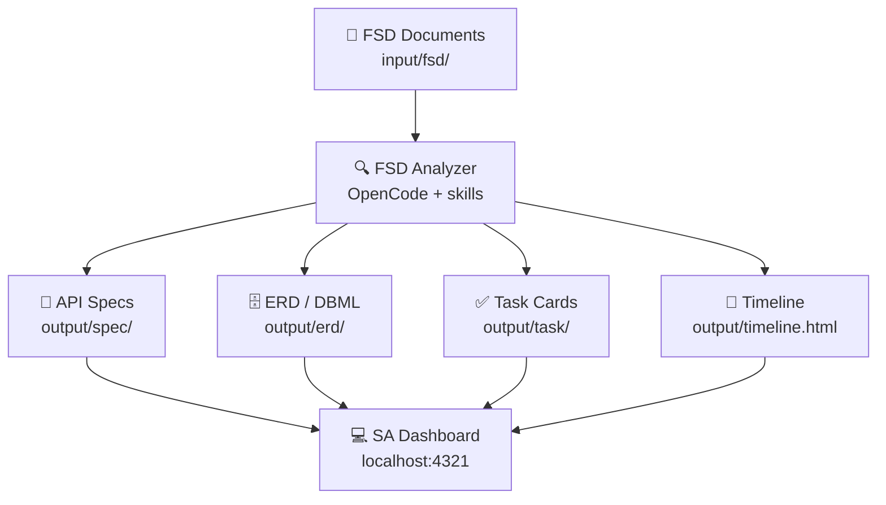

# SA Dashboard

**A full-stack web dashboard for System Analysts.** View and manage FSD documents, API specs, ERD schemas, task cards, wiki pages, and development timelines — all powered by AI agents with the `fsd-analyzer` skill.



## Features

| Page | What it does |
|------|-------------|
| **Projects** | Open project folders, auto-install required AI skills |
| **Overview** | File browser, stat cards, Markdown content viewer |
| **ERD** | DBML editor with interactive schema visualization, table editor |
| **API Spec** | Parsed spec viewer with module sidebar, search, markdown cards |
| **Wiki** | Editable project wiki pages with history |
| **Tasks** | Task cards with search, filters, developer assignment, copy to Jira/Monday |
| **FSD Analyzer** | Notion-like Markdown editor, completeness checklist, PDF/DOCX upload → Markdown conversion, Run Analysis via OpenCode |
| **Timeline** | Rendered Gantt chart viewer (`output/timeline.html`) |
| **Terminal** | Built-in agent terminal for running CLI commands |

## Prerequisites

The dashboard delegates AI analysis (FSD → API specs, ERD, tasks, timeline) to a local CLI agent. **You must have at least one of these installed and on your `PATH`** — the app auto-detects them in this priority order:

| Agent | Install command |
|-------|-----------------|
| **OpenCode** | `npm i -g opencode-ai` or see [opencode.ai](https://opencode.ai) |
| **Claude Code** | `npm i -g @anthropic-ai/claude-code` |
| **Codex** | `npm i -g @openai/codex` |

The FSD **Run Analysis** button, agent terminal, and skills auto-install all depend on a detected agent.

## Quick Start

```bash
# Requirements: Bun 1.3+, one of OpenCode / Claude Code / Codex (see above)

cd app
bun install
bun run dev
# → http://localhost:4321
```

1. Click **Open Project** in the dashboard
2. Select a project folder (must have `input/` and `output/` structure)
3. Required skills (`fsd-analyzer`, `markitdown`) auto-install on first open
4. Use the **FSD Analyzer** tab to edit FSDs and run AI analysis

## Desktop App (Tauri)

Onesist also ships as a native desktop app for **macOS (arm64/x64)** and **Windows**, built with Tauri 2. The web app runs as a self-contained compiled Bun server (sidecar) inside the desktop shell.

### Prerequisites (developer machine)

The same [agent CLI requirement](#prerequisites) applies to the desktop app: install at least one of **OpenCode**, **Claude Code**, or **Codex** and make sure it's on your `PATH` (the sidecar spawns it via `which`).

```bash
# Rust toolchain
curl https://sh.rustup.rs -sSf | sh

# Tauri CLI (via Bun)
cd app
bun add -D @tauri-apps/cli
```

- macOS: Xcode Command Line Tools (`xcode-select --install`)
- Windows: Visual Studio Build Tools (MSVC C++ workload)

### Run desktop app (dev mode)

```bash
cd app
bun run tauri dev
```

### Build desktop app (release)

```bash
cd app
bunx tauri build
# macOS → src-tauri/target/release/bundle/dmg/Onesist_*.dmg
# Windows → src-tauri/target/release/bundle/msi/Onesist_*.msi
```

Debug build (faster, for testing):

```bash
bunx tauri build --debug
# → src-tauri/target/debug/bundle/
```

### Server-only build (for sidecar bundling)

```bash
cd app
bun run build:server
```

Produces `dist/server/server.js` + a self-contained compiled executable in `src-tauri/binaries/onesist-server-<triple>`. Tauri bundles this as the sidecar and copies `dist/` (web assets) + `vendor/skills` into the app data folder on first run.

### Desktop app data location

- macOS: `~/Library/Application Support/com.rogasper.onesist/`
- Windows: `%APPDATA%\com.rogasper.onesist\`

Contains `data.db` (SQLite), `server/` (copied web assets), `vendor-skills/`, and `logs/`.

### Important: don't run `bun run dev` while the desktop app is running

The dev server and the desktop sidecar both listen on port 4321. Running them at the same time causes the desktop WebView to hit the wrong server (agent detection, file watching, etc. break). Always **quit the desktop app** (tray → Quit) before starting `bun run dev`, and vice versa.

### Tray & lifecycle

- Close window → app hides to tray (agent sessions keep running)
- Tray menu: **Show Onesist** / **Restart Server** / **Quit** — only Quit fully exits
- If the sidecar crashes it auto-restarts (max 3× per 60s)

## Scripts

```bash
bun run dev          # Start dev server (web, http://localhost:4321)
bun run build        # Production build (Vite)
bun run typecheck    # TypeScript type checking
bun run start        # Start production server
bun run build:server # Build server bundle + compiled sidecar executable
bunx tauri dev       # Run desktop app in dev mode
bunx tauri build     # Build desktop app (release)
bunx tauri build --debug  # Build desktop app (debug, faster)
```

## Architecture

```
Browser (React)
    ↕
Vite Dev Server (SSR)
    ↕
TanStack Start (fetch handler)
    ↕
API Router (Bun)
    ↕
┌─────────────────────────────────────────────────────────┐
│ Drizzle ORM (Bun SQLite)                                │
│ ├── projects, tasks, wikiPages, erds, apiSpecs,         │
│ │   apiEndpoints, fsdSessions, changeLog                │
│ └── snapshots: wikiSnapshots, taskSnapshots,            │
│                erdSnapshots, apiSnapshots               │
├─────────────────────────────────────────────────────────┤
│ File System (project-root/)                             │
│ ├── input/fsd/         FSD documents                    │
│ ├── input/figma/       Screenshots                      │
│ ├── output/spec/       Generated API specs              │
│ ├── output/erd/        Generated ERD schemas            │
│ ├── output/task/       Generated task cards             │
│ └── output/timeline.html Gantt chart                    │
├─────────────────────────────────────────────────────────┤
│ OpenCode CLI (headless)                                 │
│ ├── fsd-analyzer skill → generate specs, erd, tasks     │
│ └── markitdown skill   → convert PDF/DOCX to Markdown   │
├─────────────────────────────────────────────────────────┤
│ Terminal Server (ws://localhost:4323)                    │
│ └── xterm.js + WebSocket for agent terminal             │
└─────────────────────────────────────────────────────────┘
```

## Tech Stack

| Layer | Technology |
|-------|-----------|
| Runtime | Bun 1.3+ |
| Frontend | React 19, TanStack Start (SSR), TanStack Router |
| Editor | CodeMirror 6 + @codemirror/lang-markdown |
| Diagrams | Mermaid 11, DBML (@dbml/core) |
| ERD Layout | @xyflow/react + @dagrejs/dagre |
| Markdown | react-markdown + remark-gfm |
| Database | Drizzle ORM + Bun SQLite (WAL mode) |
| Terminal | xterm.js + WebSocket |
| Styling | @cloudflare/kumo + Tailwind CSS 4 |
| Icons | @phosphor-icons/react |
| Agent CLI | OpenCode (headless + JSONL output) |
| Build | Vite 8, TypeScript 6 |
| Desktop | Tauri 2 (Rust), Bun sidecar (compiled executable) |

## Project Skill Requirements

The SA Dashboard requires two skills installed per project folder:

| Skill | Source | Purpose |
|-------|--------|---------|
| `fsd-analyzer` | [rogasper/system-analyst-skill](https://github.com/rogasper/system-analyst-skill) | FSD → API spec, ERD, UML, tasks, timeline |
| `markitdown` | [julianobarbosa/claude-code-skills](https://github.com/julianobarbosa/claude-code-skills) | Convert PDF/DOCX/PPTX/XLSX to Markdown |

These are auto-installed into `.agents/skills/` when opening a project folder.

## OpenCode Agents

Three agents are configured for this app:

| Agent | Purpose |
|-------|---------|
| `architecture-plan` | High-level planning and reasoning (read-only) |
| `execute` | Code generation, file operations, command execution |
| `code-reviewer` | Security, performance, and edge-case review |

## Scripts

```bash
bun run dev          # Start dev server (web, http://localhost:4321)
bun run build        # Production build (Vite)
bun run typecheck    # TypeScript type checking
bun run start        # Start production server
bun run build:server # Build server bundle + compiled sidecar executable
bunx tauri dev       # Run desktop app in dev mode
bunx tauri build     # Build desktop app (release)
bunx tauri build --debug  # Build desktop app (debug, faster)
```

## Database

```bash
# Generate migrations after schema changes
bun run db:generate

# Push schema to database
bun run db:push
```

Tables: `projects`, `erds`, `erd_snapshots`, `api_specs`, `api_snapshots`, `api_endpoints`, `wiki_pages`, `wiki_snapshots`, `tasks`, `task_snapshots`, `fsd_sessions`, `change_log`, `exports`

Migrations run automatically at startup via ALTER TABLE in `src/server/db/client.ts`.

## License

MIT
