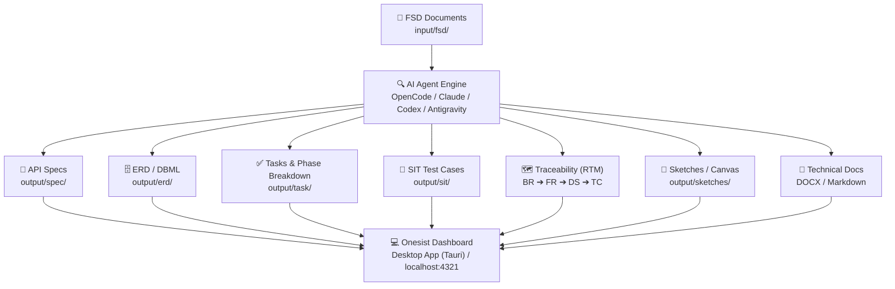

# Onesist (SA Dashboard)

**A full-stack desktop & web workspace for System Analysts.** View, edit, and orchestrate AI-generated system specifications, FSD documents, API specs, ERD schemas, test cases, task breakdowns, traceability matrices, and visual canvas sketches — all integrated seamlessly with CLI AI agents.



[](https://github.com/rogasper/onesist)

## Features

| Feature / Page | What it does |
|----------------|-------------|
| **Projects Dashboard** | Manage and organize project repositories with automatic skill installation (`fsd-analyzer`, `markitdown`). |
| **Project Overview** | Project hub with multi-root file browser, stats, quick actions, and native file context menu actions. |
| **FSD Analyzer** | MDXEditor rich markdown editor for FSDs, completeness checklist, one-click PDF/DOCX-to-Markdown conversion, and AI analysis runner. |
| **ERD Studio** | Interactive database schema visualization (ReactFlow + Dagre layout) powered by DBML, visual table editor, and SQL/DBML export. |
| **API Specs** | Parsed REST/OpenAPI spec viewer with module navigation, interactive search, request/response payloads, and markdown endpoint cards. |
| **Tasks & Phases** | Sprint & phase-grouped task breakdown with Story Point trackers, collapsible phase accordions, multi-select bulk actions (status update, mass archive/unarchive), manual sticky phase edits, and Jira/Monday export. |
| **SIT (System Integration Testing)** | Module and scope-based test case manager with step-by-step test execution, expected results, and status tracking. |
| **Traceability Matrix (RTM)** | Requirement Traceability Matrix mapping: **Business Requirements (BR) → Functional Requirements (FR) → Design Solutions (DS) → Test Cases (TC)** with AI gap detection. |
| **Canvas / Sketches** | Embedded Excalidraw canvas for whiteboard diagrams, UI wireframes, flowcharts, and system architecture sketches (`output/sketches/*.excalidraw.json`). |
| **Technical Documentation** | Technical documentation generator with automated metadata compilation and one-click DOCX & Markdown export. |
| **Wiki** | Knowledge base with versioned markdown wiki pages and snapshot history. |
| **Development Timeline** | Visual Gantt chart viewer (`output/timeline.html`) for multi-phase development timelines. |
| **Agent Terminal** | Embedded real-time CLI terminal (xterm.js + WebSocket) with live preference customization (font, cursor, themes) supporting multi-agent switching. |
| **Help & Guide (?)** | Per-page contextual help popups with curated best practices and prompt templates (bilingual: ID / EN). |

## Supported AI CLI Agents

Onesist delegates AI analysis, artifact generation, and code tasks to local CLI agents. The application auto-detects installed agents on your `PATH`:

| Agent | CLI Binary | Install Command | Capabilities |
|-------|------------|-----------------|--------------|
| **OpenCode** | `opencode` | `npm i -g opencode-ai` or [opencode.ai](https://opencode.ai) | Headless JSON execution, multi-agent workflows, skill auto-loading |
| **Claude Code** | `claude` | `npm i -g @anthropic-ai/claude-code` | High-depth reasoning, streaming JSON output |
| **Codex** | `codex` | `npm i -g @openai/codex` | Autonomous coding and file modifications |
| **Antigravity** | `agy` | `curl -fsSL https://antigravity.google/cli/install.sh \| bash` | Fast agentic workflows with background subagent coordination |

## Quick Start (Web Development)

```bash
# Prerequisites: Bun 1.3+, Node.js (for terminal ConPTY), and at least one CLI agent installed

# 1. Install dependencies
bun install

# 2. Start development server
bun run dev
# Open http://localhost:4321
```

1. Click **Open Project** in the dashboard.
2. Select your project folder containing standard `input/` and `output/` directories.
3. Required project skills (`fsd-analyzer`, `markitdown`) are detected and auto-installed.
4. Open the **FSD Analyzer** or **Agent Terminal** to generate specs, ERD, tasks, and documentation.

## Desktop App (Tauri 2)

Onesist ships as a native, lightweight desktop application for **macOS (Apple Silicon & Intel)** and **Windows**, powered by Tauri 2 and a compiled Bun sidecar server.

### Desktop Development

```bash
# Install Rust toolchain if not already installed
curl --proto '=https' --tlsv1.2 -sSf https://sh.rustup.rs | sh

# Run desktop in dev mode
bunx tauri dev

# Build desktop release installer
bunx tauri build
# macOS  → src-tauri/target/release/bundle/dmg/Onesist_*.dmg
# Windows → src-tauri/target/release/bundle/nsis/Onesist_*.exe
```

### Desktop Architecture & Lifecycle

* **Sidecar Engine:** The desktop shell spawns a compiled Bun server binary (`onesist-server`) that serves SSR, API routes, and handles SQLite database operations with auto-recovery and memory watchdogs.
* **Tray & Close-to-Tray:** Closing the main window minimizes to the system tray so long-running agent tasks and file watchers continue running without interruption.
* **Auto-Updater:** Built-in auto-update checking with release signatures (`@tauri-apps/plugin-updater`).
* **Desktop App Data Directory:**
  * **macOS:** `~/Library/Application Support/com.rogasper.onesist/`
  * **Windows:** `%APPDATA%\com.rogasper.onesist\`

## Documentation & Prompt Library

Comprehensive bilingual guides and prompt libraries are available in [`docs/`](docs/README.md):

* **Indonesian Guides** — [`docs/id/`](docs/id/): Alur kerja SA (FSD ➔ markitdown ➔ split FD ➔ discovery ➔ ERD ➔ API Spec ➔ Tasks + Timeline ➔ RTM ➔ Technical Docs), [Prompt Library](docs/id/08-prompt-library.md), dan [Best Practices](docs/id/09-best-practices.md).
* **English Guides** — [`docs/en/`](docs/en/): [Overview](docs/en/00-overview.md), [Prompt Library](docs/en/08-prompt-library.md), and [Best Practices](docs/en/09-best-practices.md).

## Tech Stack

| Layer | Technology |
|-------|-----------|
| **Runtime** | Bun 1.3+ & Node.js |
| **Framework** | React 19, TanStack Start (SSR), TanStack Router (File-based) |
| **Desktop Shell** | Tauri 2 (Rust) + Bun Sidecar |
| **UI Components & Styling** | @cloudflare/kumo + Tailwind CSS 4 + @phosphor-icons/react |
| **Editors** | MDXEditor (FSD/Wiki), CodeMirror 6 (+ Markdown grammar) |
| **Diagrams & Visual Canvas** | Excalidraw, Mermaid 11, DBML (@dbml/core), @xyflow/react |
| **Database & ORM** | SQLite (WAL mode) + Drizzle ORM (Automated migrations) |
| **Agent CLI & Terminal** | xterm.js + WebSocket server (Node-PTY / ConPTY) |
| **Build Tools** | Vite 8, TypeScript 6, Drizzle Kit |

## Available Scripts

```bash
bun run dev          # Start web development server (http://localhost:4321)
bun run typecheck    # Run strict TypeScript validation
bun run build        # Build production web bundle (Vite + SSR)
bun run build:server # Build server bundle + compile native sidecar binary
bun run start        # Start compiled production web server
bun run db:generate  # Generate Drizzle migrations from schema changes
bun run db:push      # Push schema changes directly to SQLite database
bunx tauri dev       # Launch desktop application in development mode
bunx tauri build     # Build production desktop installers (.dmg / .exe)
```

## Project Directory Structure Conventions

When opening a project in Onesist, the workspace organizes artifacts under standardized directory paths:

```
<project-root>/
├── input/
│   ├── fsd/             # Raw FSD files (PDF, DOCX, MD)
│   └── figma/           # Design screenshots and mockups
└── output/
    ├── spec/            # OpenAPI specs & module endpoints (.md / .yaml)
    ├── erd/             # DBML schema files (.dbml)
    ├── task/            # Phase-grouped task markdown cards (<phase>/<task>.md)
    ├── sit/             # System integration test case definitions (.md)
    ├── sketches/        # Excalidraw whiteboard sketches (.excalidraw.json)
    ├── docs/            # Generated technical documentation (.docx / .md)
    └── timeline.html    # Development Gantt chart
```

## License

MIT © [rogasper](https://github.com/rogasper)
