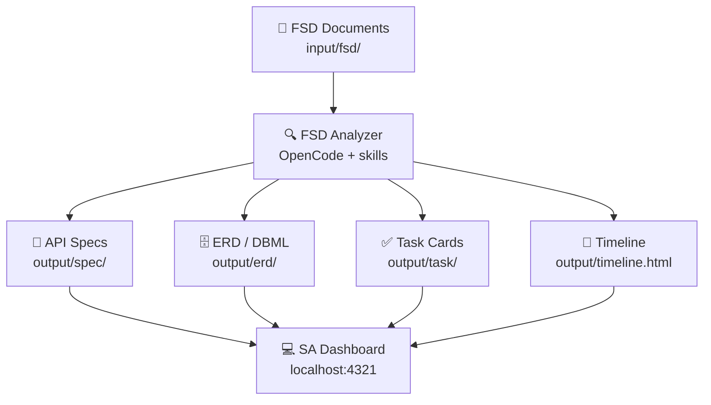

# SA Dashboard

**A full-stack web dashboard for System Analysts.** View and manage FSD documents, API specs, ERD schemas, task cards, wiki pages, and development timelines — all powered by AI agents with the `fsd-analyzer` skill.



## Features

| Page | What it does |
|------|-------------|
| **Projects** | Open project folders, auto-install required AI skills |
| **Overview** | File browser, stat cards, Markdown content viewer |
| **ERD** | DBML editor with interactive schema visualization, table editor |
| **API Spec** | Parsed spec viewer with module sidebar, search, markdown cards |
| **Wiki** | Editable project wiki pages with history |
| **Tasks** | Task cards with search, filters, developer assignment, copy to Jira/Monday |
| **FSD Analyzer** | Notion-like Markdown editor, completeness checklist, PDF/DOCX upload → Markdown conversion, Run Analysis via OpenCode |
| **Timeline** | Rendered Gantt chart viewer (`output/timeline.html`) |
| **Terminal** | Built-in agent terminal for running CLI commands |

## Quick Start

```bash
# Requirements: Bun 1.3+, OpenCode CLI 1.18+

cd app
bun install
bun run dev
# → http://localhost:4321
```

1. Click **Open Project** in the dashboard
2. Select a project folder (must have `input/` and `output/` structure)
3. Required skills (`fsd-analyzer`, `markitdown`) auto-install on first open
4. Use the **FSD Analyzer** tab to edit FSDs and run AI analysis

## Architecture

```
Browser (React)
    ↕
Vite Dev Server (SSR)
    ↕
TanStack Start (fetch handler)
    ↕
API Router (Bun)
    ↕
┌─────────────────────────────────────────────────────────┐
│ Drizzle ORM (Bun SQLite)                                │
│ ├── projects, tasks, wikiPages, erds, apiSpecs,         │
│ │   apiEndpoints, fsdSessions, changeLog                │
│ └── snapshots: wikiSnapshots, taskSnapshots,            │
│                erdSnapshots, apiSnapshots               │
├─────────────────────────────────────────────────────────┤
│ File System (project-root/)                             │
│ ├── input/fsd/         FSD documents                    │
│ ├── input/figma/       Screenshots                      │
│ ├── output/spec/       Generated API specs              │
│ ├── output/erd/        Generated ERD schemas            │
│ ├── output/task/       Generated task cards             │
│ └── output/timeline.html Gantt chart                    │
├─────────────────────────────────────────────────────────┤
│ OpenCode CLI (headless)                                 │
│ ├── fsd-analyzer skill → generate specs, erd, tasks     │
│ └── markitdown skill   → convert PDF/DOCX to Markdown   │
├─────────────────────────────────────────────────────────┤
│ Terminal Server (ws://localhost:4323)                    │
│ └── xterm.js + WebSocket for agent terminal             │
└─────────────────────────────────────────────────────────┘
```

## Tech Stack

| Layer | Technology |
|-------|-----------|
| Runtime | Bun 1.3+ |
| Frontend | React 19, TanStack Start (SSR), TanStack Router |
| Editor | CodeMirror 6 + @codemirror/lang-markdown |
| Diagrams | Mermaid 11, DBML (@dbml/core) |
| ERD Layout | @xyflow/react + @dagrejs/dagre |
| Markdown | react-markdown + remark-gfm |
| Database | Drizzle ORM + Bun SQLite (WAL mode) |
| Terminal | xterm.js + WebSocket |
| Styling | @cloudflare/kumo + Tailwind CSS 4 |
| Icons | @phosphor-icons/react |
| Agent CLI | OpenCode (headless + JSONL output) |
| Build | Vite 8, TypeScript 6 |

## Project Skill Requirements

The SA Dashboard requires two skills installed per project folder:

| Skill | Source | Purpose |
|-------|--------|---------|
| `fsd-analyzer` | [rogasper/system-analyst-skill](https://github.com/rogasper/system-analyst-skill) | FSD → API spec, ERD, UML, tasks, timeline |
| `markitdown` | [julianobarbosa/claude-code-skills](https://github.com/julianobarbosa/claude-code-skills) | Convert PDF/DOCX/PPTX/XLSX to Markdown |

These are auto-installed into `.agents/skills/` when opening a project folder.

## OpenCode Agents

Three agents are configured for this app:

| Agent | Purpose |
|-------|---------|
| `architecture-plan` | High-level planning and reasoning (read-only) |
| `execute` | Code generation, file operations, command execution |
| `code-reviewer` | Security, performance, and edge-case review |

## Scripts

```bash
bun run dev          # Start dev server
bun run build        # Production build
bun run typecheck    # TypeScript type checking
bun run start        # Start production server
```

## Database

```bash
# Generate migrations after schema changes
bun run db:generate

# Push schema to database
bun run db:push
```

Tables: `projects`, `erds`, `erd_snapshots`, `api_specs`, `api_snapshots`, `api_endpoints`, `wiki_pages`, `wiki_snapshots`, `tasks`, `task_snapshots`, `fsd_sessions`, `change_log`, `exports`

Migrations run automatically at startup via ALTER TABLE in `src/server/db/client.ts`.

## License

MIT
