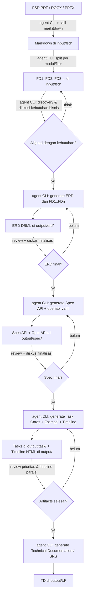

# Onesist — SA Dashboard Documentation

Dokumentasi penggunaan **Onesist (SA Dashboard)** — aplikasi untuk System Analyst yang mengubah dokumen Functional Design (FSD) menjadi artefak engineering: **ERD**, **API Spec / OpenAPI**, **Task Cards + Estimasi + Timeline**, dan **Technical Documentation (SRS)**.

This is a bilingual documentation set. Full usage guide below.

> **Penting / Important:** Dokumentasi ini ditulis dengan pendekatan **agent-CLI first** — semua aksi (convert, split, generate, finalisasi) dilakukan lewat **prompt ke agent CLI** di terminal embedded (atau `opencode run` dari terminal eksternal). Tombol-tombol aksi di UI (Convert, Generate OpenAPI, Sync to DB, Import from artifacts, Export DOCX) **dianggap eksperimental dan tidak dipakai** di alur ini. UI dipakai untuk **review / melihat hasil** saja (file di `output/` auto-refresh via file watcher).

---

## Pipeline Keseluruhan / End-to-End Workflow

---

## Navigasi / Navigation

### 🇮🇩 Bahasa Indonesia

| Dokumen | Isi |
|---------|-----|
| [00 — Pendahuluan](id/00-pendahuluan.md) | Tentang aplikasi, filosofi agent-CLI, cara kerja terminal embedded |
| [01 — Mulai Cepat](id/01-mulai-cepat.md) | Buka project, cek skill, buka terminal, pola prompt, cek hasil |
| [02 — Struktur Project & Format File](id/02-struktur-project.md) | Struktur folder project + format tiap artefak |
| [03 — Workflow FSD](id/03-workflow-fsd.md) | PDF → Markdown (markitdown) → split FD → diskusi kebutuhan |
| [04 — Workflow ERD](id/04-workflow-erd.md) | FD → ERD (DBML) → review → finalisasi |
| [05 — Workflow Spec API](id/05-workflow-spec-api.md) | FD + ERD → Spec API + openapi.yaml → review → finalisasi |
| [06 — Workflow Tasks & Timeline](id/06-workflow-tasks.md) | ERD + Spec → Task Cards → estimasi → timeline paralel |
| [07 — Workflow Dokumentasi](id/07-workflow-dokumentasi.md) | Technical Documentation / SRS dari seluruh artefak |
| [08 — Prompt Library](id/08-prompt-library.md) | Template prompt siap salin per fase |
| [09 — Best Practices](id/09-best-practices.md) | Praktik terbaik lengkap + checklist quality gates |

### 🇬🇧 English

| Document | Contents |
|----------|----------|
| [00 — Overview](en/00-overview.md) | About the app, agent-CLI philosophy, embedded terminal |
| [01 — Quick Start](en/01-quickstart.md) | Open a project, check skills, open terminal, prompt patterns |
| [02 — Project Structure & File Formats](en/02-project-structure.md) | Project folder layout + artifact formats |
| [03 — FSD Workflow](en/03-fsd-workflow.md) | PDF → Markdown (markitdown) → split FD → discovery |
| [04 — ERD Workflow](en/04-erd-workflow.md) | FD → ERD (DBML) → review → finalize |
| [05 — API Spec Workflow](en/05-spec-api-workflow.md) | FD + ERD → Spec + openapi.yaml → review → finalize |
| [06 — Tasks & Timeline Workflow](en/06-tasks-workflow.md) | ERD + Spec → Task Cards → estimation → parallel timeline |
| [07 — Documentation Workflow](en/07-documentation-workflow.md) | Technical Documentation / SRS from all artifacts |
| [08 — Prompt Library](en/08-prompt-library.md) | Copy-paste prompt templates per phase |
| [09 — Best Practices](en/09-best-practices.md) | Deep best practices + quality gate checklist |

---

## Ringkasan Singkat / TL;DR

1. **FSD PDF → Markdown** → jalankan prompt convert (skill `markitdown`) lewat terminal embedded.
2. **Split jadi FD1..FDn** → prompt split per modul/fitur ke `input/fsd/`.
3. **Diskusi kebutuhan bisnis** → mode discovery/discussion agent, kunci `QUESTION_FOR_BA` / `ASSUMPTION`.
4. **ERD** → prompt generate dari FD → review di tab ERD → finalisasi.
5. **Spec API + openapi.yaml** → prompt generate dari FD + ERD → review di tab API Spec → finalisasi.
6. **Task Cards + Estimasi + Timeline** → prompt generate dari ERD + Spec → review di tab Tasks / Timeline.
7. **Technical Documentation (SRS)** → prompt generate dari seluruh artefak → hasil di `output/td/`.

---

*Versi dokumen: 1.0.0 — 2026-08-12*
