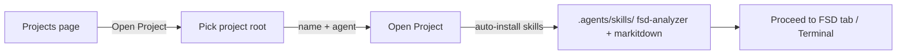
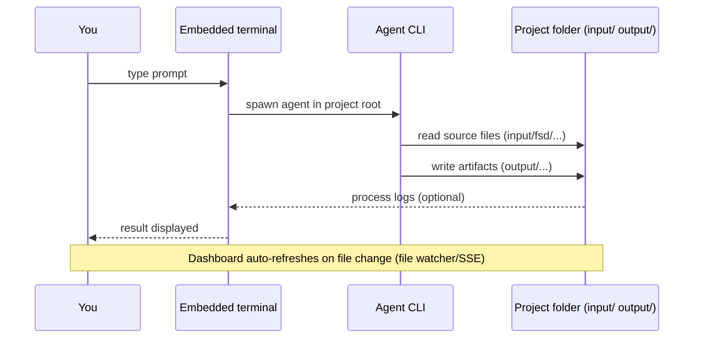

# 01 — Quick Start

A short guide to start using Onesist with the agent-CLI approach.

---

## 1. Open / Create a Project

1. Launch the app (web: `bun run dev` in the app folder, or the Tauri desktop app).
2. On the **Projects** page, click **Open Project**.
3. Pick the project folder (or type its path). This folder becomes the **project root** — all artifacts live here.
4. Fill in **Project Name** and choose a **Default Agent CLI** (opencode recommended).
5. Click **Open Project**. The app will:
   - create the project in the database,
   - check / install the **`fsd-analyzer`** and **`markitdown`** skills into `.agents/skills/`,
   - take you to the project page.

> If a red banner "Project skills failed to install" appears — click **Retry install**. Without these skills the agent cannot produce SA artifacts.



## 2. Know the Project Page

The project header has **tabs**:

| Tab | Purpose (in the agent-CLI flow) |
|-----|----------------------------------|
| **Overview** | File statistics + Markdown viewer for reading artifacts |
| **ERD** | ERD diagram viewer (renders `.dbml` from `output/erd/`) |
| **API Spec** | Spec Markdown viewer + Swagger UI for `openapi.yaml` |
| **Tasks** | Task list + Timeline view (renders task md + `timeline*.html`) |
| **FSD Analyzer** | FSD document list + Markdown editor |
| **Docs** | Metadata + template + TD prompt + result preview |
| **Wiki** | Additional documentation pages |
| **Settings** | Project name, company, default agent, terminal preferences |

And the **Terminal** button at the top right of the header → opens the agent-CLI terminal panel (see [00 — Overview](00-overview.md) §3).

## 3. Basic Prompt Pattern

In the embedded terminal (or `opencode run`), a good prompt includes:

1. **Role & skill** — `You are a Senior System Analyst. Use the fsd-analyzer skill.`
2. **Files involved** — full paths relative to the project root, e.g. `input/fsd/sources/fdd_001.pdf`.
3. **Action** — what to do (convert, split, generate, review, merge).
4. **Clear output** — target file path + format (DBML, Markdown, YAML, HTML).
5. **Constraints** — files that must **not** be changed (e.g. `DO NOT modify MASTER_ERD.md`).

Example conversion prompt:

```
You are a Senior System Analyst. Use the markitdown skill.

Convert the file `input/fsd/sources/fdd_001.pdf` to Markdown.
Write the result to `input/fsd/fsd_001.md`.
Preserve heading structure, tables, and lists. Do not modify any other files.
```

## 4. Running & Monitoring Results

- **Run the prompt**: type it in the embedded terminal and press Enter (the agent works in the project root).
- **Monitor**: the agent writes files into `output/` → the dashboard **auto-refreshes** (file watcher + SSE). ERD/Spec/Tasks/Docs tabs show new artifacts without pressing any button.
- **Check results**: open the file in the Overview tab (click it in the file browser) or open the project folder directly.



## 5. Pre-work Checklist

- [ ] Agent CLI (opencode) detected when opening the project
- [ ] `fsd-analyzer` and `markitdown` skills installed in `.agents/skills/`
- [ ] Project root has an `input/fsd/sources/` folder (where source PDFs/files go)
- [ ] (Recommended) `MASTER_ERD.md` and `MASTER_SPEC_API.md` created if a baseline exists
- [ ] Embedded terminal opens and an agent session runs

---

Next: [02 — Project Structure & File Formats](02-project-structure.md)
