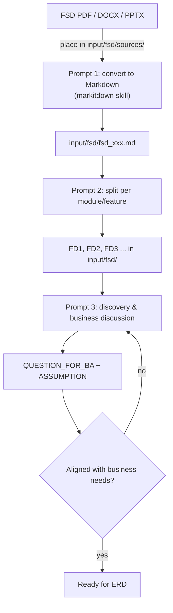

# 03 — FSD Workflow

Convert an FSD document (PDF/DOCX/PPTX) into Markdown, split it into **FDs per feature/module**, then **discuss with the agent** to align on business needs before generating the ERD/Spec.

---

## Flow



---

## Step 1 — Convert to Markdown

### Preparation

1. Place the original file (PDF/DOCX/PPTX/...) in the project folder, e.g. `input/fsd/sources/`.
   > You can also drag it into the folder on the file system, or copy it manually. Files don't have to go through the UI.

### Conversion prompt

```
You are a Senior System Analyst. Use the markitdown skill.

Convert the file `input/fsd/sources/fdd_001.pdf` into Markdown.
Write the result to `input/fsd/fsd_001.md`.
Preserve heading structure, tables, lists, and text diagrams.
Note at the end any parts that could not be read (e.g. images/OCR).
DO NOT modify any other files.
```

### Expected result

- `input/fsd/fsd_001.md` contains the document in Markdown.
- The **FSD Analyzer** tab shows the new document (auto-refresh).
- If the conversion is imperfect (broken tables, missing images) → fix via a follow-up prompt, or ask the agent to clean up the formatting.

### Prompt variations

- Multiple files at once: `Convert all files in input/fsd/sources/ to Markdown into input/fsd/ each.`
- Normalize only: `Clean up the Markdown formatting of input/fsd/fsd_001.md (headings, tables, lists) without changing the content.`

---

## Step 2 — Split into FDs

Once the Markdown is ready, split it per **feature/module** so each part can be processed (ERD, spec, tasks) separately and in parallel.

```
You are a Senior System Analyst. Use the fsd-analyzer skill.

Read `input/fsd/fsd_001.md`. Split this document into Functional Designs (FDs)
per clear module/feature. Create one file per FD:

- input/fsd/fd_001.md — <module/feature 1>
- input/fsd/fd_002.md — <module/feature 2>
- input/fsd/fd_003.md — <module/feature 3>
- etc.

Each FD file must be complete and self-contained (its flow must be clear
without reading the source document). Create a SUMMARY at input/fsd/FD_INDEX.md
listing all FDs + a one-line description each. DO NOT modify other files.
```

### Expected result

- `input/fsd/fd_001.md`, `fd_002.md`, ... — one FD per feature/module
- `input/fsd/FD_INDEX.md` — table of contents of FDs (helps subsequent prompts)
- Naming is free; just keep it consistent and referenced in later prompts

> Tip: ask the agent to name files after the module (e.g. `fd_customer.md`) for easier recognition.

---

## Step 3 — Business Discussion (Discovery)

Goal: make sure the agent understands the FDs **and** the business needs before creating the ERD/Spec. Use the **discovery/discussion mode** of the `fsd-analyzer` skill: ask the agent to **question first**, not generate right away.

```
You are a Senior System Analyst. Use the fsd-analyzer skill in DISCOVERY/DISCUSSION mode.

Read all FDs in input/fsd/ (start from FD_INDEX.md).
Do NOT generate ERD, spec, or tasks yet.

Analyze the business needs and produce a list:
1. QUESTION_FOR_BA — questions that must be answered before final design
   (flow, business rules, required data, roles/authorization, edge cases).
2. ASSUMPTION — assumptions you take + reasons (if you can't ask).
3. Your understanding summary per FD (main flow, actors, data involved).

Write the discussion to output/reports/discovery_<timestamp>.md.
Do not modify other files under input/ and output/.
```

### Expected result

- `output/reports/discovery_*.md` with questions, assumptions, and a summary of understanding.
- You read it, answer questions, and **discuss back and forth** in the terminal until:

> **Aligned** — the agent understands the needs; no critical question remains unanswered; assumptions are approved by you.

### Discussion iterations (optional)

- `Answers to the questions: <question 1>: <answer>, ...` — provide new context.
- `UPDATE: change understanding of FD_002 — <change>`. Update assumptions.
- `Ask the agent to summarize the final understanding` before proceeding.

### When to stop discussing

- All **QUESTION_FOR_BA** items that affect the design are answered / approved as assumptions.
- The agent can name the data entities and main endpoints per FD consistently.
- You agree on the module scope (In Scope / Out of Scope).

---

## FSD Phase Checklist

- [ ] Source file exists in `input/fsd/sources/`
- [ ] Converted Markdown exists in `input/fsd/`
- [ ] FDs split per module/feature (`fd_*.md`)
- [ ] `FD_INDEX.md` exists (FD list)
- [ ] Business discussion done: questions answered / assumptions approved
- [ ] Every prompt specifies output paths and "DO NOT modify other files"

---

Next: [04 — ERD Workflow](04-erd-workflow.md) — once FSD is aligned.
