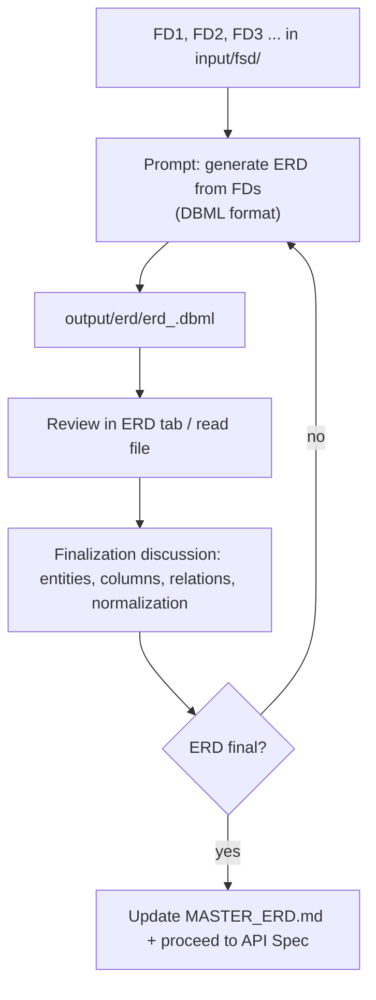

# 04 — ERD Workflow

Once the FSD is aligned with business needs, ask the agent to build an **ERD** from FD1..FDn, then review and finalize it.

---

## Flow



---

## Step 1 — Generate ERD

Basic prompt (one ERD per module, or one file per module as needed):

```
You are a Senior System Analyst. Use the fsd-analyzer skill.

From the following FDs:
- input/fsd/fd_001.md
- input/fsd/fd_002.md
- (etc., or refer to FD_INDEX.md)

Build a complete ERD:
- Entities/tables with columns (type, not null, default)
- Primary keys & foreign keys (Ref: ...)
- Indexes & unique constraints
- Relations between tables (1-N, N-M) per the business flow

Write the ERD to output/erd/erd_<module>.dbml in DBML format.
Follow existing naming conventions (e.g. mst_*, trn_*) — if none, add a NOTE.
DO NOT modify other files (including MASTER_ERD.md).
```

### Expected result

- `output/erd/erd_<module>.dbml` — ready-to-render ERD.
- The **ERD** tab shows the diagram automatically (canvas + DBML editor).

> Variation: ask for one combined file `output/erd/erd_all.dbml` for all FDs, or per module for focused review. For a parallel per-module flow, per-module files are more practical.

---

## Step 2 — Review

Review in the **ERD tab** (renders `.dbml`) and/or read the file directly. Check:

1. **Completeness** — every entity mentioned in the FDs is present; no feature is missed.
2. **Relation correctness** — cardinality matches the business flow (1-1, 1-N, N-M via a pivot table).
3. **Normalization** — no redundant columns; master vs transaction data separated (`mst_` vs `trn_`).
4. **Conventions** — naming consistent with the project (mst_*, trn_*, etc.).
5. **Fit to requirements** — required fields (not null), unique, indexes for main queries.

Note findings as discussion points for the agent.

---

## Step 3 — Discussion & Finalization

Ask the agent for revisions in the terminal:

- `ERD fd_001: add table trn_order_items as the N-M pivot between order and product.`
- `The email column in mst_customer must be unique.`
- `Remove the redundant total_price column — it is computed from the details.`
- `Normalize: split the customer address into a separate table.`
- `Add an index on (customer_id, status) in trn_order.`

The agent updates `output/erd/erd_<module>.dbml`. Repeat the review until:

> **ERD final** — all tables, columns, and relations are approved.

### Quality checks before finalizing

- [ ] Every entity has a PK
- [ ] Every FK has a valid reference (table & column exist)
- [ ] Relations consistent with the business flow in the FDs
- [ ] No unnecessary column duplication between tables
- [ ] Naming convention followed / NOTE recorded

---

## Step 4 — Update Master

Once the module ERD is final, ask the agent to merge it into the rolling context (optional but recommended for multi-module projects):

```
Merge the finalized ERD from output/erd/erd_<module>.dbml into MASTER_ERD.md.
Add a short changelog (date + FD number). Do not remove existing sections.
```

> See [09 — Best Practices](09-best-practices.md) §Master Artifacts for keeping it consistent.

---

## ERD Phase Checklist

- [ ] `output/erd/erd_<module>.dbml` created from aligned FDs
- [ ] ERD reviewed (completeness, relations, normalization, conventions)
- [ ] Revisions applied until final
- [ ] (Optional) `MASTER_ERD.md` updated
- [ ] Final ERD becomes input for the API Spec

---

Next: [05 — API Spec Workflow](05-spec-api-workflow.md)
