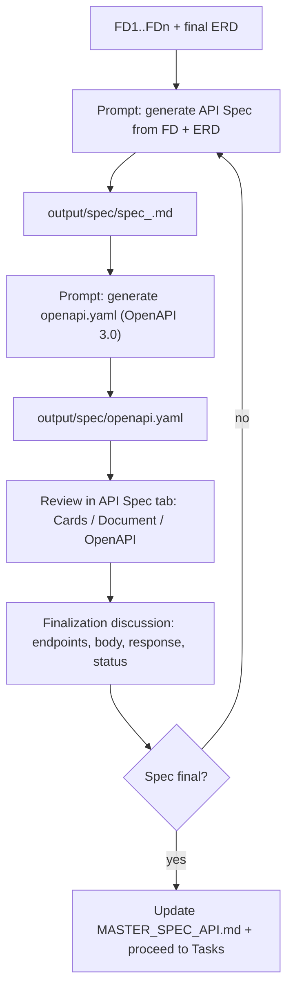

# 05 — API Spec Workflow

After the **ERD is final**, ask the agent to create the **API Spec** (Markdown per module) and **`openapi.yaml`** (OpenAPI 3.0), then review and finalize.

---

## Flow



---

## Step 1 — Generate API Spec (Markdown)

```
You are a Senior System Analyst. Use the fsd-analyzer skill.

From the FDs and ERD:
- input/fsd/FD_INDEX.md (+ relevant fd_*.md)
- output/erd/erd_<module>.dbml (final schema)

Build a complete API Spec for module <module>:
- Endpoint list per resource (Method | Path | Purpose)
- Per endpoint: request body, query params, response (success + error),
  validation, status codes, auth/role requirements
- Follow project API conventions (envelope, pagination, error catalog) —
  if none, use common standards and note them

Write to output/spec/spec_<module>.md.
DO NOT modify other files (including MASTER_SPEC_API.md and the ERD).
```

### Expected result

- `output/spec/spec_<module>.md` — per-module spec.
- The **API Spec** tab shows endpoint cards (Cards view) or the document (Document view) — auto-refresh.

---

## Step 2 — Generate openapi.yaml

```
You are a Senior System Analyst. Use the fsd-analyzer skill.

Generate an OpenAPI 3.0 file (openapi.yaml) from ALL specs in output/spec/:
- Combine all endpoints, unique paths, no duplicates
- Every operation MUST have: summary, description, tags, requestBody/
  parameters, responses
- Endpoint status: x-status: done (complete/ready) or in-develop (changing);
  if a spec mentions a phase (e.g. "Phase 2"), write x-phase: <number>
- info.title = <project name>, info.version = 1.0.0

Write to output/spec/openapi.yaml.
DO NOT modify markdown files or any other files.
```

### Expected result

- `output/spec/openapi.yaml` — centralized API documentation.
- **API Spec → OpenAPI** tab shows Swagger UI (Done / In Develop / Phase legend) — auto-refresh.

---

## Step 3 — Review

Review in the **API Spec** tab (Cards/Document/OpenAPI) and/or read the file. Check per endpoint:

1. **Method & Path** — matches the resource and is REST-ish; consistent with the FDs.
2. **Request** — body/query/path params complete, types match the ERD.
3. **Response** — success + error structure, correct status codes.
4. **Auth/Role** — which endpoints require authentication/authorization (role matrix).
5. **Consistency with ERD** — request/response fields exist in the related tables; relations covered.
6. **Conventions** — response envelope, pagination, error codes consistent.

Note findings for discussion.

---

## Step 4 — Discussion & Finalization

Ask the agent for revisions:

- `Endpoint POST /api/customers — add email format validation.`
- `The 400 response must follow the standard error envelope {code, message, details}.`
- `GET /api/orders needs a status query param and pagination (page, limit).`
- `This endpoint requires the admin role (see the role matrix in the FDs).`
- `Update openapi.yaml to stay in sync with this spec change.`

Repeat until:

> **Spec final** — endpoints, request/response contracts, and status are approved. Make sure `openapi.yaml` is updated to stay in sync.

### Quality checks before finalizing

- [ ] All endpoints required by the FDs are covered
- [ ] No duplicate paths / method conflicts
- [ ] Request/response consistent with the final ERD
- [ ] Auth & errors documented
- [ ] `openapi.yaml` in sync with the spec markdown

---

## Step 5 — Update Master

```
Merge the finalized spec from output/spec/spec_<module>.md into MASTER_SPEC_API.md.
Add a short changelog (date + FD number). Do not remove existing sections.
```

---

## API Spec Phase Checklist

- [ ] `output/spec/spec_<module>.md` created from final FD + ERD
- [ ] `output/spec/openapi.yaml` created and in sync
- [ ] Spec reviewed (endpoints, request/response, auth, ERD consistency)
- [ ] Revisions applied until final
- [ ] (Optional) `MASTER_SPEC_API.md` updated
- [ ] Final spec becomes the input for Tasks

---

Next: [06 — Tasks & Timeline Workflow](06-tasks-workflow.md)
