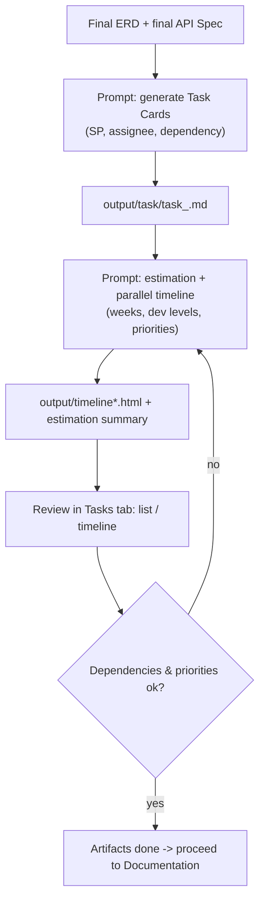

# 06 — Tasks & Timeline Workflow

After the **ERD** and **API Spec are final**, ask the agent to produce **Task Cards** with **estimates**, **developer levels**, and a **parallel work timeline** (priorities).

---

## Flow



---

## Step 1 — Generate Task Cards

```
You are a Senior System Analyst. Use the fsd-analyzer skill.

From the finalized ERD and API Spec:
- output/erd/erd_<module>.dbml
- output/spec/spec_<module>.md

Build developer Task Cards for module <module>:
- Break down into sub-tasks: DB, Backend (BE), Frontend (FE), Integration, Test
- Each task contains: Code, Title, Description, Goals, Scope, Out of scope,
  Acceptance Criteria, Flow Logic (numbered steps), Story Points (1 SP = 4h),
  Assignee (by level: BE Senior/Mid/Junior, FE Senior/Mid/Junior),
  Module/Phase, Dependency (Depends On, Blocks), basic SQL (sql block),
  Request/Response example (json block), QC Checklist
- Include a summary table at the top (Code | Task | SP | Assignee | Dependency)

Write to output/task/task_<module>.md.
DO NOT modify other files.
```

### Expected result

- `output/task/task_<module>.md` — task cards ready for review.
- The **Tasks** tab shows the tasks (List/Cards view) — auto-refresh.

> Variation: one combined file `output/task/MASTER_TASK.md` for the whole project if modules are few, or per module for parallel work.

---

## Step 2 — Estimation & Parallel Timeline

```
You are a Senior System Analyst. Use the fsd-analyzer skill (timeline estimation mode).

Read all tasks in output/task/ (task_*.md).

Build the development estimation and timeline:
1. Estimate per task & per module (person-days / weeks):
   - Story Points (1 SP = 4h) -> convert to days/weeks
2. Team assumptions:
   - <number> developers at level (BE/FE Senior/Mid/Junior) — state the mix
3. Because multiple tasks run IN PARALLEL, produce:
   - Work priority order (what goes first, what can run together)
   - Dependencies & critical path
   - Developer utilization (no idle / overloaded)
4. Generate a self-contained HTML Gantt chart to output/timeline_<module>.html
   (openable directly in a browser)
5. Write the estimation summary + team assumptions + risks to
   output/reports/estimation_<timestamp>.md

DO NOT modify task files or any other files.
```

### Expected result

- `output/timeline_<module>.html` — Gantt chart (rendered by **Tasks → Timeline**).
- `output/reports/estimation_*.md` — estimation summary, team mix, risks.

---

## Step 3 — Review

Review in the **Tasks** tab (list + detail) and **Timeline**. Check:

1. **Granularity** — tasks assignable to one developer and QA-able.
2. **Story Points** — realistic; total per module is reasonable.
3. **Dependencies** — `Depends On` / `Blocks` make sense; no circular dependencies.
4. **Assignee & level** — matches task difficulty (junior vs senior).
5. **Parallel timeline** — priorities correct, critical path reasonable, utilization balanced.

### Iterate

- `Task T-003 is too big — split it into 2 tasks.`
- `Change the team mix: 2 BE Mid + 1 FE Senior.`
- `Prioritize the auth module before the others.`
- `T-007 depends on T-004, fix the dependency.`
- `Regenerate the timeline with the new team mix.`

Until:

> **Tasks & timeline final** — priorities, week estimates, and developer allocation are approved.

---

## Tasks Phase Checklist

- [ ] `output/task/task_<module>.md` created from final ERD + Spec
- [ ] Every task has Story Points + assignee level + dependencies
- [ ] Estimates in weeks with a clear team mix
- [ ] Parallel timeline (priorities + critical path) produced
- [ ] `output/timeline*.html` renders in Tasks → Timeline
- [ ] Final tasks become input for Documentation

---

Next: [07 — Documentation Workflow](07-documentation-workflow.md)
