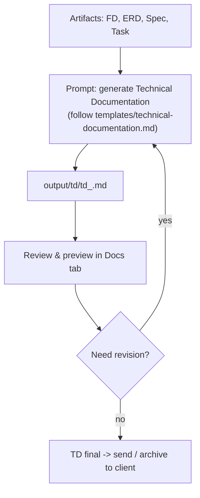
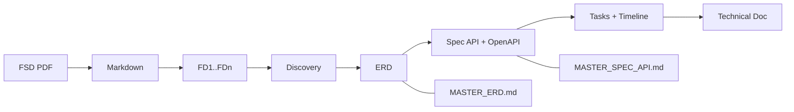

# 07 — Documentation Workflow (Technical Documentation / SRS)

After **all artifacts are done** (FD → ERD, API Spec, Tasks), ask the agent to build the **Technical Documentation (TD)** as the final SRS document for the client.

---

## Flow



---

## Step 1 — Generate Technical Documentation

The template lives at `templates/technical-documentation.md` (project root). Its structure: Cover → Approvals → Introduction → References → Project Scope (In/Out) → Effort Estimation → System Overview (mermaid **or** ```diagram-svg/```svg premium) → Requirement Detail (per FD: FE spec + BE spec + endpoints) → ERD Appendix (mermaid **or** ```diagram-svg/```svg) → Data Specification. Fence ```diagram-svg {"type":"pipeline"}``` / ```svg <svg>…``` is recommended for client-facing SRS (vector preview, sharp DOCX raster via `src/lib/diagram-svg.ts` + `src/lib/docx-export.ts`); mermaid for internal sketches.

```
You are a Senior System Analyst. Use the fsd-analyzer skill.

Build the final Technical Documentation / Software Requirement Specification (SRS)
for the project from all artifacts:
- FD: input/fsd/ (FD_INDEX.md + fd_*.md)
- ERD: output/erd/*.dbml and/or MASTER_ERD.md
- API Spec: output/spec/*.md and openapi.yaml
- Tasks: output/task/*.md (for Effort Estimation & timeline)

Metadata:
- Customer Name: <customer name>
- Project Name: <project name>
- Project ID: <id>
- Version: <version>
- Author: <author>

Follow the template at templates/technical-documentation.md:
- Replace ALL placeholders ({{customerName}}, {{projectName}}, {{projectId}},
  {{version}}, {{author}}, {{date}}) with the metadata above and today's date.
- Keep the structure and <!-- pagebreak --> markers exactly as-is. Do not remove sections.
- Requirement Detail: break down per FD SEPARATELY (do not merge),
  grouped per module with numbered headings; per FD:
  - Front End specification (screens, components, UI flow, consumed APIs)
  - Back End specification (services, business logic)
  - One sub-section per endpoint: ##### METHOD /path + a 2-column table
    (Field | Value) with Type, Status, Description, Endpoint, Method,
    Request, Response, Table Related (+ Note/Validation/Logic when needed)
- System Overview & ERD Appendix: replace placeholder mermaid blocks with real diagrams. For client SRS, **use ```diagram-svg {"type":"pipeline"}``` (FSD→Delivery) or raw ```svg``` premium** — vector preview in `MarkdownViewer` (`src/components/diagram/DiagramSvgBlock.tsx`) and sharp PNG raster on DOCX export. Alternative: business flowchart + erDiagram mermaid for internal use.
- Effort Estimation: derive from the story points in output/task, per module/
  phase, expressed in person-days/weeks.

Write the result to output/td/td_<timestamp>.md.
Use English for descriptive text, keep technical terms in English.
DO NOT modify any source artifact files.
```

### Expected result

- `output/td/td_<timestamp>.md` — complete TD document.
- The **Docs** tab shows a preview (renders markdown + mermaid diagrams) — auto-refresh.

---

## Step 2 — Review & Preview

Review in the **Docs** tab (preview) and/or read the file directly. Check:

1. **Metadata & cover** — project name, customer, version, date correct.
2. **Section completeness** — every template section is filled (irrelevant ones marked N/A, not removed).
3. **Requirement Detail** — each FD appears separately with FE + BE spec + endpoints consistent with the API Spec.
4. **Diagrams** — System Overview (flowchart) and ERD Appendix (erDiagram) are valid and accurate. For client SRS, verify ```diagram-svg/```svg renders as vector and DOCX is sharp (don't use mermaid HTML labels for client entrega).
5. **Effort Estimation** — consistent with the story points / timeline in the tasks.

### Revisions

- `Add a use-case diagram in System Overview.`
- `In Effort Estimation, break it down per module.`
- `Fix the endpoint table in FD_002 — the Table Related column is empty.`
- `Update the version to 1.1.0 and today's date.`

Regenerate until:

> **TD final** — complete, consistent with all artifacts, ready to send.

---

## Step 3 — Distribution

The result is a plain Markdown file. Distribution options:

- **Open & copy** from the Docs tab (or any editor) into Confluence/Google Docs.
- **DOCX export** — the **Export DOCX** button in the Docs tab now handles `mermaid` **and** ```diagram-svg/```svg premium (canvas raster → PNG via `src/routes/projects.$id.docs.tsx` + `src/lib/diagram-svg.ts` → `src/lib/docx-export.ts`). Alternative: Pandoc `pandoc output/td/td_x.md -o td.docx` (but native DOCX is sharper for vector diagrams).

---

## Documentation Phase Checklist

- [ ] All artifacts (FD, ERD, Spec, Tasks) final & ready
- [ ] Metadata complete (customer, project, version, author)
- [ ] `output/td/td_<timestamp>.md` created following the template
- [ ] All sections filled; placeholders replaced
- [ ] Diagrams valid (mermaid for internal, ```diagram-svg/```svg premium for clients — verify vector preview & DOCX)
- [ ] Effort Estimation consistent with the tasks
- [ ] TD reviewed & final (see [08 — Prompt Library](08-prompt-library.md) P9 + P12 for premium diagrams)

---

## End-to-End Summary



Done. For per-phase prompt details see [08 — Prompt Library](08-prompt-library.md). For best practices see [09 — Best Practices](09-best-practices.md).
