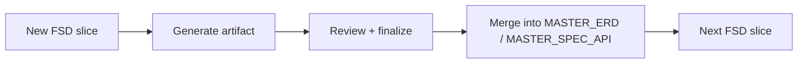

# 09 — Best Practices

Complete best practices for the SA workflow using Onesist + agent CLI. This document will keep evolving. Most come from the `fsd-analyzer` skill conventions and production experience.

---

## 1. Master Artifacts — Single Source of Truth

**`MASTER_ERD.md`** and **`MASTER_SPEC_API.md`** are the rolling context for multi-module projects.

- **Bootstrap once**: copy the existing baseline (e.g. from `output/erd/erd_now.md`, `output/spec/spec_api.md`) into the master files.
- **Merge incrementally**: every finalized FSD slice only **adds/changes the affected parts** in the master — not a new file per FSD.
- **Prompt with master**: `@MASTER_ERD.md @MASTER_SPEC_API.md @fsd_xxx.md` — no need to attach every legacy file.
- **The agent must NOT modify the master files without your explicit instruction** (see §5 Anti-patterns).



## 2. Discovery Before Generating

Don't generate ERD/Spec straight from an ambiguous FSD.

- Run **discovery/discussion mode**: ask for `QUESTION_FOR_BA` and `ASSUMPTION`.
- **Don't let the agent guess silently** — every assumption must be explicit (`ASSUMPTION: ... — Reason: ...`).
- Only generate after critical questions are answered / approved as assumptions.

## 3. Correct Phase Order

Follow the order from the `fsd-analyzer` skill:

```text
Discovery → Discussion → API Spec → ERD (if data changes) → Tasks → Timeline
```

Why:
- **Spec first, ERD after** (if only data changes) — API contracts clarify which data must be stored.
- **ERD & Spec must be final before Tasks** — good tasks need a stable design.
- **Timeline last** — it needs tasks + assignees + clear dependencies.

> Note: your workflow (ERD → Spec → Tasks) is also valid. The key point is **not** to jump to Tasks before the ERD & Spec are final.

## 4. Good Estimation & Timeline

- **1 Story Point = 4 hours** (skill convention).
- Tasks must be **granular** — assignable to one developer and QA-able.
- Every task must have **dependency fields** (`Depends On`, `Blocks`, `Critical Path`).
- Parallel timeline:
  - **Critical path** identified (the longest path determining total duration).
  - **Developer utilization** balanced — no idle/overload without a warning.
  - Realistic team mix (count & level of BE/FE).
- **Risks** documented (DB migration, third-party integration, external dependencies).

## 5. Prompt Engineering

### Do

| Item | Example |
|------|---------|
| State role + skill | `You are a Senior System Analyst. Use the fsd-analyzer skill.` |
| State source files with full paths | `input/fsd/fd_001.md` |
| State output path + format | `Write to output/erd/erd_customer.dbml (DBML)` |
| Add file constraints | `DO NOT modify other files.` |
| One focus per prompt | Don't mix "generate ERD + spec + task" in one prompt |
| Ask for standard formats | DBML fenced blocks, Method/Path tables, tasks with SP & dependencies |
| Iterate the review | Generate → review → revision prompt → only then final |

### Avoid (Anti-patterns)

- ❌ Prompt without an output path — the agent guesses locations, results are messy.
- ❌ Letting the agent modify `MASTER_*` / other artifact files without instruction.
- ❌ Generating **all** artifacts at once from an un-discussed FSD — hard to review and often inconsistent.
- ❌ Letting the agent assume silently — ask for explicit `ASSUMPTION`.
- ❌ Random naming — ask for consistent conventions (`fsd_`, `fd_`, `erd_`, `spec_`, `task_`).
- ❌ Overly long prompts mixing many modules — split per module.

## 6. Review Gates (Quality Gates)

Before treating a phase as "final", run the checklist:

### ERD
- [ ] Every entity has a PK; every FK is valid (reference exists)
- [ ] Relations consistent with the FD business flow (correct cardinality)
- [ ] Reasonable normalization (no unnecessary redundancy; master vs transaction separated)
- [ ] Naming conventions followed (`mst_*`, `trn_*`) or a NOTE recorded
- [ ] Indexes & unique constraints for the main queries

### API Spec
- [ ] All FD-required endpoints covered
- [ ] No duplicate paths / method conflicts
- [ ] Request/response consistent with the final ERD
- [ ] Auth & roles documented (role-permission matrix)
- [ ] Error envelope & status codes follow an error catalog
- [ ] `openapi.yaml` in sync with the spec markdown

### Tasks
- [ ] Granular (assign to 1 dev + QA-ready)
- [ ] All tasks have Story Points + assignee level + dependencies
- [ ] No circular dependencies
- [ ] Timeline: critical path + balanced utilization + clear priorities

### Documentation
- [ ] Every template section filled (irrelevant ones = N/A, not removed)
- [ ] Mermaid diagrams valid (System Overview + ERD Appendix)
- [ ] Effort Estimation consistent with the tasks
- [ ] Metadata placeholders replaced

## 7. Cross-Artifact Consistency

- **ERD ↔ Spec ↔ Task** must be aligned: ERD entities appear as fields in the spec; tasks reference existing endpoints & tables.
- Run a **consistency check** regularly (prompt P11):
  - `compare_artifacts` — check entities in FSD vs ERD.
  - `validate_erd` / `validate_spec` — validate DBML syntax & spec structure.
- If drift appears (e.g. a task references a non-existent endpoint) → fix before final.

## 8. Database Naming Conventions

- **Existing tables/columns**: keep as-is (including `mst_`, `trn_`, historical typos) — no mass rename without a decision + migration.
- **New tables**: follow the project convention (master → `mst_…`, transaction → `trn_…`) once agreed; otherwise add a **NOTE**.
- In gap reports, old vs new naming is reported as **INFO/WARN**, not a silent rewrite.

## 9. Schema Changes → Migration Plan

When a gap analysis finds DB changes (from a new FSD):

- Build a **migration plan** (zero-downtime, rollback, deployment order, data migration).
- Don't change production DB directly — document first, discuss with the DB team.
- Separate "column rename" from functional changes.

## 10. Context & File Management

- **`input/fsd/sources/`** = archive of original files; **don't** treat it as the main workspace.
- **`output/`** = artifacts; historical snapshots can stay as an archive/baseline.
- **`FD_INDEX.md`** is very useful for giving context to the agent in later prompts.
- Keep **`project_context.md`** (tech stack, env, auth, conventions) — the agent uses it for consistency.

## 11. Data Safety & Workflow Hygiene

- **Version control** the project folder (git) — artifacts are files; keep history.
- Use the full **Definition of Done** checklist per phase (see §6).
- When the agent changes files, **ask for a short report** of files changed/created — an audit trail.
- Don't run two agents on the same folder in parallel (write conflicts).

---

*Last updated: 2026-08-12. This documentation will keep evolving with field practice.*
