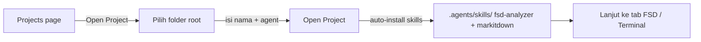
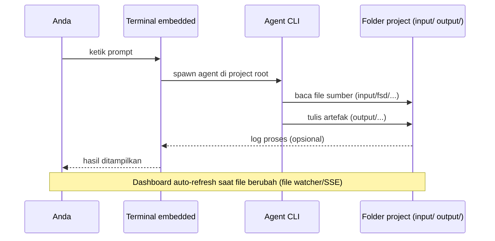

# 01 — Mulai Cepat

Panduan ringkas untuk mulai menggunakan Onesist dengan pendekatan agent-CLI.

---

## 1. Buka / Buat Project

1. Jalankan aplikasi (web: `bun run dev` di folder aplikasi, atau aplikasi desktop Tauri).
2. Pada halaman **Projects**, klik **Open Project**.
3. Pilih folder project (atau ketik path-nya). Folder ini akan menjadi **project root** — semua artefak tinggal di sini.
4. Isi **Project Name** dan pilih **Default Agent CLI** (opencode disarankan).
5. Klik **Open Project**. Aplikasi akan:
   - membuat project di database,
   - mengecek / menginstal skill **`fsd-analyzer`** dan **`markitdown`** ke `.agents/skills/`,
   - membawa Anda ke halaman project.

> Jika ada banner merah "Project skills failed to install" — klik **Retry install**. Tanpa skill ini, agent tidak bisa menghasilkan artefak SA.



## 2. Kenali Halaman Project

Header project berisi **tab**:

| Tab | Kegunaan (dalam alur agent-CLI) |
|-----|---------------------------------|
| **Overview** | Statistik file + penampil Markdown untuk membaca artefak |
| **ERD** | Penampil diagram ERD (render `.dbml` dari `output/erd/`) |
| **API Spec** | Penampil spec Markdown + Swagger UI untuk `openapi.yaml` |
| **Tasks** | Daftar task + view Timeline (render task md + `timeline*.html`) |
| **FSD Analyzer** | Daftar dokumen FSD + editor Markdown |
| **Docs** | Metadata + template + prompt TD + preview hasil |
| **Wiki** | Halaman dokumentasi tambahan |
| **Settings** | Nama project, company, agent default, preferensi terminal |

Dan tombol **Terminal** di kanan atas header → membuka panel terminal agent CLI (lihat [00 — Pendahuluan](00-pendahuluan.md) §3).

## 3. Pola Dasar Prompt

Di terminal embedded (atau `opencode run`), prompt ideal berisi:

1. **Peran & skill** — `Kamu adalah Senior System Analyst. Gunakan skill fsd-analyzer.`
2. **File yang terlibat** — sebutkan path lengkap relatif project root, mis. `input/fsd/sources/fdd_001.pdf`.
3. **Tindakan** — apa yang harus dilakukan (convert, split, generate, review, merge).
4. **Output yang jelas** — path file tujuan + format (DBML, Markdown, YAML, HTML).
5. **Batasan** — file yang **jangan** diubah (mis. `JANGAN ubah MASTER_ERD.md`).

Contoh prompt convert:

```
Kamu adalah Senior System Analyst. Gunakan skill markitdown.

Convert file `input/fsd/sources/fdd_001.pdf` menjadi Markdown.
Tulis hasilnya ke `input/fsd/fsd_001.md`.
Pertahankan struktur heading, tabel, dan list. Jangan mengubah file lain.
```

## 4. Menjalankan & Memantau Hasil

- **Jalankan prompt**: ketik di terminal embedded lalu tekan Enter (agent bekerja di project root).
- **Monitor**: agent menghasilkan file di `output/` → dashboard **auto-refresh** (file watcher + SSE). Tab ERD/Spec/Tasks/Docs akan menampilkan artefak baru tanpa perlu menekan tombol.
- **Cek hasil**: buka file di tab Overview (klik file di file browser) atau buka folder project langsung.



## 5. Checklist Awal Sebelum Bekerja

- [ ] Agent CLI (opencode) terdeteksi saat membuka project
- [ ] Skill `fsd-analyzer` dan `markitdown` terinstal di `.agents/skills/`
- [ ] Project root sudah berisi folder `input/fsd/sources/` (tempat PDF/asal ditaruh)
- [ ] (Disarankan) `MASTER_ERD.md` dan `MASTER_SPEC_API.md` dibuat jika sudah ada baseline
- [ ] Terminal embedded bisa dibuka dan sesi agent berjalan

---

Lanjut ke [02 — Struktur Project & Format File](02-struktur-project.md)
