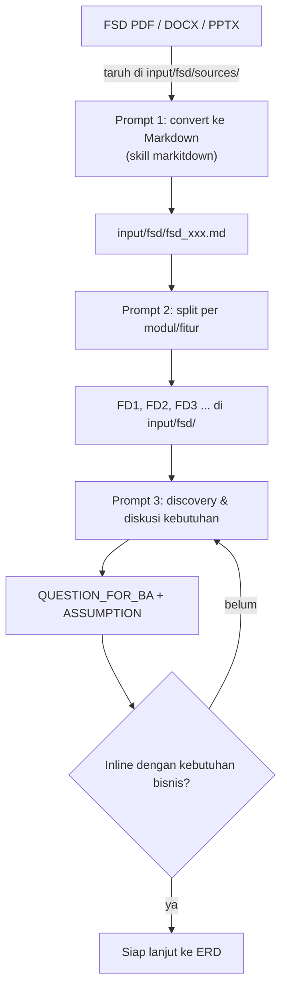

# 03 — Workflow FSD

Mengubah dokumen FSD (PDF/DOCX/PPTX) menjadi Markdown, memecahnya menjadi **FD per fitur/modul**, lalu **berdiskusi dengan agent** untuk memastikan pemahaman kebutuhan bisnis sebelum generate ERD/Spec.

---

## Alur



---

## Tahap 1 — Convert ke Markdown

### Persiapan

1. Letakkan file asli (PDF/DOCX/PPTX/...) di folder project, misalnya `input/fsd/sources/`.
   > Bisa juga dengan cara lain: drag ke folder project di file system, atau copy manual. File tidak harus lewat UI.

### Prompt convert

```
Kamu adalah Senior System Analyst. Gunakan skill markitdown.

Convert file `input/fsd/sources/fdd_001.pdf` menjadi Markdown.
Tulis hasilnya ke `input/fsd/fsd_001.md`.
Pertahankan struktur heading, tabel, list, dan diagram teks.
Beri catatan di akhir jika ada bagian yang tidak terbaca (mis. gambar/OCR).
JANGAN mengubah file lain.
```

### Hasil yang diharapkan

- File `input/fsd/fsd_001.md` berisi dokumen dalam Markdown.
- Tab **FSD Analyzer** menampilkan dokumen baru (auto-refresh).
- Jika konversi tidak sempurna (tabel berantakan, gambar hilang) → perbaiki via prompt, atau minta agent merapikan formatnya.

### Variasi prompt

- Banyak file sekaligus: `Convert semua file di input/fsd/sources/ menjadi Markdown ke input/fsd/ masing-masing.`
- Hanya menormalkan: `Rapikan format Markdown input/fsd/fsd_001.md (heading, tabel, list) tanpa mengubah isi.`

---

## Tahap 2 — Split menjadi FD

Setelah Markdown jadi, pisahkan per **fitur/modul** agar setiap bagian bisa diproses (ERD, spec, task) secara terpisah dan paralel.

```
Kamu adalah Senior System Analyst. Gunakan skill fsd-analyzer.

Baca `input/fsd/fsd_001.md`. Pisahkan dokumen ini menjadi Functional Design (FD)
per modul/fitur yang jelas. Buat satu file per FD:

- input/fsd/fd_001.md — <nama modul/fitur 1>
- input/fsd/fd_002.md — <nama modul/fitur 2>
- input/fsd/fd_003.md — <nama modul/fitur 3>
- dst.

Setiap file FD harus lengkap dan berdiri sendiri (jelas alurnya tanpa
membaca dokumen sumber). Buat file SUMMARY di input/fsd/FD_INDEX.md
berisi daftar FD + satu baris deskripsi. JANGAN mengubah file lain.
```

### Hasil yang diharapkan

- `input/fsd/fd_001.md`, `fd_002.md`, ... — satu FD per fitur/modul
- `input/fsd/FD_INDEX.md` — daftar isi FD (membantu agent berikutnya)
- Penamaan bebas; yang penting konsisten dan direferensikan di prompt berikutnya

> Tips: minta agent menamai file sesuai modul (mis. `fd_customer.md`) agar mudah dikenali.

---

## Tahap 3 — Diskusi Kebutuhan Bisnis (Discovery)

Tujuan: memastikan agent memahami FD **dan** kebutuhan bisnis sebelum membuat ERD/Spec. Gunakan **mode discovery/discussion** dari skill `fsd-analyzer`: agent diminta **bertanya dulu**, bukan langsung generate.

```
Kamu adalah Senior System Analyst. Gunakan skill fsd-analyzer dalam MODE DISCOVERY/DISCUSSION.

Baca semua FD di input/fsd/ (mulai dari FD_INDEX.md).
Jangan generate ERD, spec, atau task dulu.

Analisis kebutuhan bisnis dan buat daftar:
1. QUESTION_FOR_BA — pertanyaan yang harus dijawab sebelum desain final
   (alur, rule bisnis, data wajib, role/otorisasi, edge cases).
2. ASSUMPTION — asumsi yang kamu ambil + alasan (kalau tidak bisa bertanya).
3. Ringkasan pemahamanmu per FD (alur utama, aktor, data yang terlibat).

Tulis hasil diskusi ke output/reports/discovery_<timestamp>.md.
Jangan mengubah file di input/ dan output/ lainnya.
```

### Hasil yang diharapkan

- File `output/reports/discovery_*.md` berisi pertanyaan, asumsi, dan ringkasan pemahaman.
- Anda membaca, menjawab pertanyaan, dan **berdiskusi bolak-balik** di terminal sampai:

> **Aligned** — agent memahami kebutuhan; tidak ada pertanyaan kritis yang belum terjawab; asumsi sudah Anda setujui.

### Iterasi diskusi (opsional)

- `Jawaban untuk pertanyaan: <pertanyaan 1>: <jawaban>, ...` — beri konteks baru.
- `UPDATE: ubah pemahaman FD_002 — <perubahan>`. Perbarui asumsi.
- `Minta agent merangkum pemahaman final` sebelum lanjut.

### Kapan berhenti berdiskusi

- Semua **QUESTION_FOR_BA** yang berdampak ke desain sudah terjawab / disetujui jadi asumsi.
- Agent bisa menyebutkan entitas data & endpoint utama per FD secara konsisten.
- Anda setuju dengan cakupan modul (In Scope / Out of Scope).

---

## Checklist Tahap FSD

- [ ] File sumber ada di `input/fsd/sources/`
- [ ] Markdown hasil convert ada di `input/fsd/`
- [ ] FD sudah dipecah per modul/fitur (`fd_*.md`)
- [ ] Ada `FD_INDEX.md` (daftar FD)
- [ ] Diskusi kebutuhan selesai: pertanyaan terjawab / asumsi disetujui
- [ ] Semua prompt menyebutkan output path dan "JANGAN mengubah file lain"

---

Lanjut ke [04 — Workflow ERD](04-workflow-erd.md) — setelah FSD aligned.
