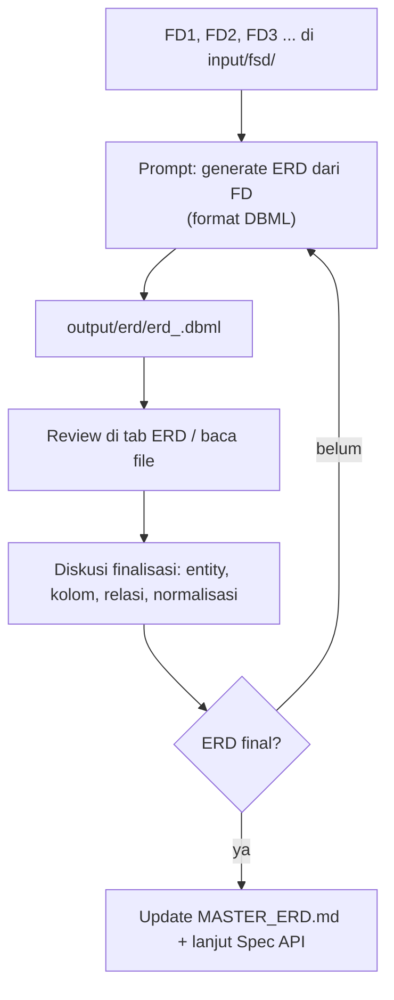

# 04 — Workflow ERD

Setelah FSD aligned dengan kebutuhan bisnis, minta agent membuat **ERD** dari FD1..FDn, lalu review dan finalisasi.

---

## Alur



---

## Tahap 1 — Generate ERD

Prompt dasar (satu ERD per modul, atau satu file per modul sesuai kebutuhan):

```
Kamu adalah Senior System Analyst. Gunakan skill fsd-analyzer.

Dari FD berikut:
- input/fsd/fd_001.md
- input/fsd/fd_002.md
- (dst., bisa rujuk FD_INDEX.md)

Buatkan ERD lengkap:
- Entity/tabel beserta kolom (tipe, not null, default)
- Primary key & foreign key (Ref: ...)
- Index & unique constraint
- Relasi antar tabel (1-N, N-M) sesuai alur bisnis

Tulis ERD ke output/erd/erd_<modul>.dbml dalam format DBML.
Ikuti konvensi penamaan yang sudah ada (mis. mst_*, trn_*) —
jika belum ada konvensi, beri NOTE.
JANGAN mengubah file lain (termasuk MASTER_ERD.md).
```

### Hasil yang diharapkan

- `output/erd/erd_<modul>.dbml` — ERD siap dirender.
- Tab **ERD** otomatis menampilkan diagram (canvas + DBML editor).

> Variasi: minta satu file gabungan `output/erd/erd_all.dbml` untuk seluruh FD, atau per modul agar review lebih fokus. Untuk alur paralel per modul, file per modul lebih praktis.

---

## Tahap 2 — Review

Review di **tab ERD** (render `.dbml`) dan/atau baca file langsung. Periksa:

1. **Kelengkapan** — semua entity yang disebut FD ada; tidak ada fitur yang terlewat.
2. **Kebenaran relasi** — cardinality sesuai alur bisnis (1-1, 1-N, N-M via tabel pivot).
3. **Normalisasi** — tidak ada kolom redundan; data master vs transaksi terpisah (`mst_` vs `trn_`).
4. **Konvensi** — penamaan konsisten dengan project (mst_*, trn_*, dsb.).
5. **Kesesuaian dengan kebutuhan** — field wajib (not null), unique, index untuk query utama.

Catat temuan sebagai poin diskusi untuk agent.

---

## Tahap 3 — Diskusi & Finalisasi

Ajukan revisi ke agent di terminal:

- `ERD fd_001: tambahkan tabel trn_order_items sebagai pivot N-M antara order dan product.`
- `Kolom email di mst_customer harus unique.`
- `Hapus kolom redundant total_price — dihitung dari detail.`
- `Normalisasi: pisahkan alamat customer ke tabel terpisah.`
- `Tambahkan index pada (customer_id, status) di trn_order.`

Agent memperbarui `output/erd/erd_<modul>.dbml`. Ulangi review sampai:

> **ERD final** — semua tabel, kolom, dan relasi sudah disetujui.

### Quality checks sebelum final

- [ ] Setiap entity punya PK
- [ ] Setiap FK punya referensi valid (tabel & kolom ada)
- [ ] Relasi konsisten dengan alur bisnis di FD
- [ ] Tidak ada duplikasi kolom antar tabel (redudansi tidak perlu)
- [ ] Konvensi penamaan diikuti / NOTE dicatat

---

## Tahap 4 — Update Master

Setelah ERD modul final, minta agent menggabungkan ke konteks rolling (opsional tapi disarankan untuk project multi-modul):

```
Merge ERD yang sudah final dari output/erd/erd_<modul>.dbml ke MASTER_ERD.md.
Tambah changelog singkat (tanggal + nomor FD). Jangan hapus bagian yang ada.
```

> Baca [09 — Best Practices](09-best-practices.md) §Master Artifacts untuk cara menjaga konsistensi.

---

## Checklist Tahap ERD

- [ ] `output/erd/erd_<modul>.dbml` dibuat dari FD yang aligned
- [ ] ERD direview (kelengkapan, relasi, normalisasi, konvensi)
- [ ] Revisi diterapkan sampai final
- [ ] (Opsional) `MASTER_ERD.md` diperbarui
- [ ] ERD final menjadi input untuk Spec API

---

Lanjut ke [05 — Workflow Spec API](05-workflow-spec-api.md)
