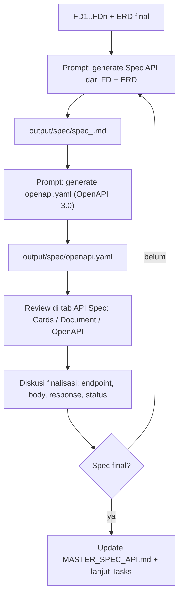

# 05 — Workflow Spec API

Setelah **ERD final**, minta agent membuat **API Spec** (Markdown per modul) dan **`openapi.yaml`** (OpenAPI 3.0), lalu review dan finalisasi.

---

## Alur



---

## Tahap 1 — Generate Spec API (Markdown)

```
Kamu adalah Senior System Analyst. Gunakan skill fsd-analyzer.

Dari FD dan ERD berikut:
- input/fsd/FD_INDEX.md (+ fd_*.md yang relevan)
- output/erd/erd_<modul>.dbml (schema final)

Buatkan API Spec lengkap untuk modul <modul>:
- Daftar endpoint per resource (Method | Path | Purpose)
- Per endpoint: request body, query params, response (sukses + error),
  validasi, status code, kebutuhan auth/role
- Ikuti konvensi API project (envelope, pagination, error catalog) —
  jika belum ada, gunakan standar yang umum dan catat

Tulis ke output/spec/spec_<modul>.md.
JANGAN mengubah file lain (termasuk MASTER_SPEC_API.md dan ERD).
```

### Hasil yang diharapkan

- `output/spec/spec_<modul>.md` — spec per modul.
- Tab **API Spec** menampilkan kartu endpoint (view Cards) atau dokumen (view Document) — auto-refresh.

---

## Tahap 2 — Generate openapi.yaml

```
Kamu adalah Senior System Analyst. Gunakan skill fsd-analyzer.

Generate file OpenAPI 3.0 (openapi.yaml) dari SEMUA spec di output/spec/:
- Gabungkan semua endpoint, path unik, tanpa duplikasi
- Setiap operation wajib punya: summary, description, tags, requestBody/
  parameters, responses
- Tentukan status tiap endpoint: x-status: done (lengkap/siap) atau
  in-develop (masih berubah); jika spec menyebut fase (mis. "Phase 2"),
  tulis x-phase: <angka>
- info.title = nama project, info.version = 1.0.0

Tulis ke output/spec/openapi.yaml.
JANGAN modifikasi file markdown atau file lain.
```

### Hasil yang diharapkan

- `output/spec/openapi.yaml` — dokumentasi API terpusat.
- Tab **API Spec → OpenAPI** menampilkan Swagger UI (legend Done / In Develop / Phase) — auto-refresh.

---

## Tahap 3 — Review

Review di tab **API Spec** (Cards/Document/OpenAPI) dan/atau baca file. Periksa per endpoint:

1. **Method & Path** — sesuai resource dan REST-ish; konsisten dengan FD.
2. **Request** — body/query/path params lengkap, tipe sesuai ERD.
3. **Response** — struktur sukses + error, status code tepat.
4. **Auth/Role** — endpoint mana yang butuh autentikasi/otorisasi (role matrix).
5. **Konsistensi dengan ERD** — field di request/response ada di tabel terkait; relasi terjawab.
6. **Konvensi** — envelope response, pagination, error code konsisten.

Catat temuan untuk diskusi.

---

## Tahap 4 — Diskusi & Finalisasi

Ajukan revisi ke agent:

- `Endpoint POST /api/customers — tambahkan validasi email format.`
- `Response 400 harus mengikuti error envelope standar {code, message, details}.`
- `GET /api/orders perlu query param status dan pagination (page, limit).`
- `Endpoint ini harus ada role admin (lihat role matrix di FD).`
- `Perbarui openapi.yaml agar sinkron dengan perubahan spec ini.`

Ulangi sampai:

> **Spec final** — endpoint, kontrak request/response, dan status sudah disetujui. Pastikan `openapi.yaml` ikut diperbarui agar sinkron.

### Quality checks sebelum final

- [ ] Semua endpoint yang dibutuhkan FD tercakup
- [ ] Tidak ada duplikasi path / konflik method
- [ ] Request/response konsisten dengan ERD final
- [ ] Auth & error documented
- [ ] `openapi.yaml` sinkron dengan spec markdown

---

## Tahap 5 — Update Master

```
Merge spec yang sudah final dari output/spec/spec_<modul>.md ke MASTER_SPEC_API.md.
Tambahkan changelog singkat (tanggal + nomor FD). Jangan hapus bagian yang ada.
```

---

## Checklist Tahap Spec API

- [ ] `output/spec/spec_<modul>.md` dibuat dari FD + ERD final
- [ ] `output/spec/openapi.yaml` dibuat dan sinkron
- [ ] Spec direview (endpoint, request/response, auth, konsistensi ERD)
- [ ] Revisi diterapkan sampai final
- [ ] (Opsional) `MASTER_SPEC_API.md` diperbarui
- [ ] Spec final menjadi input untuk Tasks

---

Lanjut ke [06 — Workflow Tasks & Timeline](06-workflow-tasks.md)
