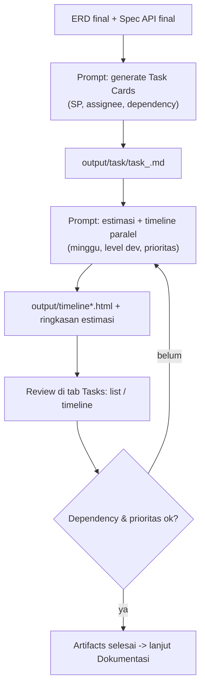

# 06 — Workflow Tasks & Timeline

Setelah **ERD** dan **Spec API final**, minta agent membuat **Task Cards** lengkap dengan **estimasi**, **level developer**, dan **timeline pengerjaan paralel** (prioritas).

---

## Alur



---

## Tahap 1 — Generate Task Cards

```
Kamu adalah Senior System Analyst. Gunakan skill fsd-analyzer.

Dari ERD dan Spec API yang final:
- output/erd/erd_<modul>.dbml
- output/spec/spec_<modul>.md

Buatkan Task Cards developer untuk modul <modul>:
- Break down per sub-task: DB, Backend (BE), Frontend (FE), Integration, Test
- Setiap task berisi: Code, Title, Deskripsi, Goals, Scope, Out of scope,
  Acceptance Criteria, Flow Logic (langkah bernomor), Story Points (1 SP = 4 jam),
  Assignee (per level: BE Senior/Mid/Junior, FE Senior/Mid/Junior),
  Module/Phase, Dependency (Depends On, Blocks), SQL dasar (blok sql),
  Request/Response contoh (blok json), QC Checklist
- Sertakan tabel ringkasan di atas (Code | Task | SP | Assignee | Dependency)

Tulis ke output/task/task_<modul>.md.
JANGAN mengubah file lain.
```

### Hasil yang diharapkan

- `output/task/task_<modul>.md` — kartu task siap direview.
- Tab **Tasks** menampilkan task (view List/Cards) — auto-refresh.

> Variasi: satu file gabungan `output/task/MASTER_TASK.md` untuk seluruh project jika modulnya sedikit, atau per modul untuk paralel.

---

## Tahap 2 — Estimasi & Timeline Paralel

```
Kamu adalah Senior System Analyst. Gunakan skill fsd-analyzer (mode timeline estimation).

Baca semua task di output/task/ (task_*.md).

Buatkan estimasi dan timeline pengembangan:
1. Estimasi per task & per modul (person-days / weeks):
   - Story Points (1 SP = 4 jam) -> konversi ke hari/minggu
2. Asumsi tim:
   - <jumlah> developer dengan level (BE/FE Senior/Mid/Junior) — sebutkan komposisinya
3. Karena dikerjakan PARALEL beberapa task sekaligus, buatkan:
   - Urutan prioritas pengerjaan (mana yang duluan, mana bisa barengan)
   - Dependency & critical path
   - Developer utilization (tidak ada yang nganggur / overload)
4. Generate HTML Gantt chart self-contained ke output/timeline_<modul>.html
   (buka langsung di browser)
5. Tulis ringkasan estimasi + asumsi tim + risiko ke output/reports/estimation_<timestamp>.md

JANGAN mengubah file task atau file lain.
```

### Hasil yang diharapkan

- `output/timeline_<modul>.html` — Gantt chart (tab **Tasks → Timeline** merendernya).
- `output/reports/estimation_*.md` — ringkasan estimasi, komposisi tim, risiko.

---

## Tahap 3 — Review

Review di tab **Tasks** (list + detail) dan **Timeline**. Periksa:

1. **Granularitas** — task bisa di-assign ke satu developer dan di-QA.
2. **Story Points** — realistis; total per modul wajar.
3. **Dependency** — `Depends On` / `Blocks` masuk akal; tidak ada circular dependency.
4. **Assignee & level** — sesuai kesulitan task (junior vs senior).
5. **Timeline paralel** — prioritas benar, critical path wajar, utilization seimbang.

### Iterasi

- `Task T-003 terlalu besar — pecah menjadi 2 task.`
- `Ubah komposisi tim: 2 BE Mid + 1 FE Senior.`
- `Prioritaskan modul auth dulu sebelum modul lain.`
- `T-007 bergantung pada T-004, perbaiki dependency-nya.`
- `Regenerate timeline dengan komposisi tim yang baru.`

Sampai:

> **Task & timeline final** — prioritas, estimasi minggu, dan pembagian developer disetujui.

---

## Checklist Tahap Tasks

- [ ] `output/task/task_<modul>.md` dibuat dari ERD + Spec final
- [ ] Setiap task punya Story Points + assignee level + dependency
- [ ] Estimasi dalam minggu dengan komposisi tim jelas
- [ ] Timeline paralel (prioritas + critical path) dibuat
- [ ] `output/timeline*.html` bisa dirender di tab Tasks → Timeline
- [ ] Task final menjadi input untuk Dokumentasi

---

Lanjut ke [07 — Workflow Dokumentasi](07-workflow-dokumentasi.md)
