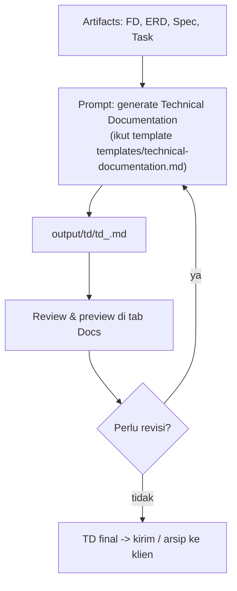
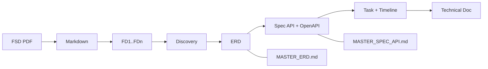

# 07 — Workflow Dokumentasi (Technical Documentation / SRS)

Setelah **semua artefak selesai** (FD → ERD, Spec API, Task), minta agent membuat **Technical Documentation (TD)** sebagai dokumen SRS final untuk klien.

---

## Alur



---

## Tahap 1 — Generate Technical Documentation

Template tersedia di `templates/technical-documentation.md` (root project). Strukturnya: Cover → Approvals → Introduction (Purpose, Background, Objectives, References, Version History) → Project Scope (In/Out) → Effort Estimation → System Overview (diagram mermaid) → Requirement Detail (per FD: FE spec + BE spec + endpoint) → Lampiran ERD (diagram mermaid) → Data Specification.

```
Kamu adalah Senior System Analyst. Gunakan skill fsd-analyzer.

Buatkan Technical Documentation / Software Requirement Specification (SRS)
final untuk project dari seluruh artefak berikut:
- FD: input/fsd/ (FD_INDEX.md + fd_*.md)
- ERD: output/erd/*.dbml dan/atau MASTER_ERD.md
- API Spec: output/spec/*.md dan openapi.yaml
- Task: output/task/*.md (untuk Effort Estimation & timeline)

Metadata:
- Customer Name: <nama customer>
- Project Name: <nama project>
- Project ID: <id>
- Version: <versi>
- Author: <author>

Ikuti template di templates/technical-documentation.md:
- Ganti SEMUA placeholder ({{customerName}}, {{projectName}}, {{projectId}},
  {{version}}, {{author}}, {{date}}) dengan metadata di atas dan tanggal hari ini.
- Pertahankan struktur & marker <!-- pagebreak --> apa adanya. Jangan hapus section.
- Requirement Detail: pecah per FD secara TERPISAH (jangan digabung),
  kelompokkan per modul dengan heading bernomor; per FD:
  - Front End specification (screens, komponen, alur UI, API yang dikonsumsi)
  - Back End specification (services, business logic)
  - Satu sub-bagian per endpoint: ##### METHOD /path + tabel 2 kolom
    (Field | Value) berisi Type, Status, Description, Endpoint, Method,
    Request, Response, Table Related (+ Note/Validation/Logic jika perlu)
- System Overview & Lampiran ERD: ganti blok placeholder mermaid dengan
  diagram asli (flowchart bisnis + erDiagram dari tabel final).
- Effort Estimation: turunkan dari story points di output/task, per modul/fase,
  dinyatakan dalam person-days/weeks.

Tulis hasil ke output/td/td_<timestamp>.md.
Gunakan bahasa Indonesia untuk deskripsi, Inggris untuk istilah teknis.
JANGAN mengubah file artefak sumber.
```

### Hasil yang diharapkan

- `output/td/td_<timestamp>.md` — dokumen TD lengkap.
- Tab **Docs** menampilkan preview (render markdown + diagram mermaid) — auto-refresh.

---

## Tahap 2 — Review & Preview

Review di tab **Docs** (preview kiri) dan/atau baca file langsung. Periksa:

1. **Metadata & cover** — nama project, customer, versi, tanggal benar.
2. **Kelengkapan section** — semua section template terisi (yang tidak relevan ditandai N/A, bukan dihapus).
3. **Requirement Detail** — setiap FD muncul terpisah dengan FE + BE spec + endpoint yang konsisten dengan Spec API.
4. **Diagram** — System Overview (flowchart) dan Lampiran ERD (erDiagram) valid dan sesuai.
5. **Effort Estimation** — konsisten dengan story points / timeline di task.

### Revisi

- `Tambahkan Use Case diagram di System Overview.`
- `Di Effort Estimation, pecah per modul.`
- `Perbaiki tabel endpoint di FD_002 — kolom Table Related kosong.`
- `Update versi ke 1.1.0 dan tanggal hari ini.`

Regenerate sampai:

> **TD final** — lengkap, konsisten dengan semua artefak, siap dikirim.

---

## Tahap 3 — Distribusi

File hasil adalah Markdown biasa. Opsi distribusi:

- **Buka & salin** dari tab Docs (atau editor apa pun) ke Confluence/Google Docs.
- **Export DOCX** — tersedia di UI (tombol ekspor), tapi **eksperimental**; alternatif: gunakan tool konversi markdown→docx (mis. Pandoc: `pandoc output/td/td_x.md -o td.docx`) jika tombol tidak berfungsi.

---

## Checklist Tahap Dokumentasi

- [ ] Semua artefak (FD, ERD, Spec, Task) sudah final & siap
- [ ] Metadata lengkap (customer, project, versi, author)
- [ ] `output/td/td_<timestamp>.md` dibuat mengikuti template
- [ ] Semua section terisi; placeholder terganti
- [ ] Diagram mermaid valid (System Overview + Lampiran ERD)
- [ ] Effort Estimation konsisten dengan task
- [ ] TD direview & final

---

## Ringkasan Keseluruhan



Selesai. Untuk detail prompt setiap tahap, lihat [08 — Prompt Library](08-prompt-library.md). Untuk praktik terbaik, lihat [09 — Best Practices](09-best-practices.md).
