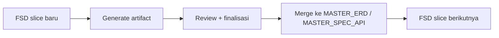

# 09 — Best Practices

Praktik terbaik lengkap untuk alur SA menggunakan Onesist + agent CLI. Dokumen ini akan terus dikembangkan. Sebagian besar bersumber dari konvensi skill `fsd-analyzer` dan pengalaman produksi.

---

## 1. Master Artifacts — Satu Sumber Kebenaran

**`MASTER_ERD.md`** dan **`MASTER_SPEC_API.md`** adalah konteks rolling untuk project multi-modul.

- **Bootstrap sekali**: salin baseline yang ada (mis. dari `output/erd/erd_now.md`, `output/spec/spec_api.md`) ke master.
- **Merge incremental**: setiap FSD slice yang final hanya **menambah/mengubah bagian terdampak** di master — bukan membuat file baru per FSD.
- **Prompt memakai master**: `@MASTER_ERD.md @MASTER_SPEC_API.md @fsd_xxx.md` — tidak perlu melampirkan semua file lama.
- **Agent TIDAK boleh mengubah master tanpa instruksi eksplisit** dari Anda (lihat §5 Anti-pattern).



## 2. Discovery Sebelum Generate

Jangan langsung generate ERD/Spec dari FSD yang ambigu.

- Jalankan **mode discovery/discussion**: minta `QUESTION_FOR_BA` dan `ASSUMPTION`.
- **Jangan biarkan agent menebak diam-diam** — setiap asumsi harus eksplisit (`ASSUMPTION: ... — Reason: ...`).
- Baru generate setelah pertanyaan kritis terjawab / disetujui sebagai asumsi.

## 3. Urutan Fase yang Benar

Ikuti urutan dari skill `fsd-analyzer`:

```text
Discovery → Discussion → Spec API → ERD (jika ada perubahan data) → Tasks → Timeline
```

Alasan:
- **Spec dulu, ERD setelahnya** (jika hanya perubahan data) — kontrak API menjelaskan data apa yang perlu disimpan.
- **ERD & Spec harus final sebelum Task** — task yang baik butuh desain stabil.
- **Timeline terakhir** — butuh task + assignee + dependency yang jelas.

> Catatan: workflow Anda (ERD → Spec → Task) juga valid. Yang penting **jangan** lompat ke Task sebelum ERD & Spec final.

## 4. Estimasi & Timeline yang Baik

- **1 Story Point = 4 jam** (konvensi skill).
- Task harus **granular** — bisa di-assign ke satu developer dan di-QA.
- Semua task wajib punya **dependency fields** (`Depends On`, `Blocks`, `Critical Path`).
- Timeline paralel:
  - **Critical path** diidentifikasi (jalur terlama yang menentukan durasi total).
  - **Developer utilization** seimbang — tidak ada yang idle/overload tanpa warning.
  - Komposisi tim realistis (jumlah & level BE/FE).
- **Risiko** didokumentasikan (migrasi DB, integrasi pihak ketiga, ketergantungan eksternal).

## 5. Prompt Engineering

### Lakukan

| Hal | Contoh |
|-----|--------|
| Sebutkan peran + skill | `Kamu adalah Senior System Analyst. Gunakan skill fsd-analyzer.` |
| Sebutkan file sumber dengan path lengkap | `input/fsd/fd_001.md` |
| Sebutkan output path + format | `Tulis ke output/erd/erd_customer.dbml (DBML)` |
| Beri batasan file | `JANGAN mengubah file lain.` |
| Satu fokus per prompt | Jangan campur "generate ERD + spec + task" dalam satu prompt |
| Minta format standar | DBML fenced block, tabel Method/Path, task dengan SP & dependency |
| Iterasi review | Generate → review → prompt revisi → baru final |

### Hindari (Anti-pattern)

- ❌ Prompt tanpa path output — agent menebak lokasi, hasil berantakan.
- ❌ Membiarkan agent mengubah `MASTER_*` / file artefak lain tanpa instruksi.
- ❌ Generate **semua** artefak sekaligus dari FSD yang belum didiskusikan — sulit direview dan sering tidak konsisten.
- ❌ Membiarkan agent menebak asumsi — minta `ASSUMPTION` eksplisit.
- ❌ Memakai penamaan acak — minta konvensi konsisten (`fsd_`, `fd_`, `erd_`, `spec_`, `task_`).
- ❌ Prompt yang terlalu panjang mencampur banyak modul — pecah per modul.

## 6. Review Gate (Quality Gates)

Sebelum menganggap satu fase "final", jalankan checklist:

### ERD
- [ ] Setiap entity punya PK; setiap FK valid (referensi ada)
- [ ] Relasi konsisten dengan alur bisnis di FD (cardinality benar)
- [ ] Normalisasi wajar (tidak ada redundansi tak perlu; master vs transaksi terpisah)
- [ ] Konvensi penamaan diikuti (`mst_*`, `trn_*`) atau NOTE dicatat
- [ ] Index & unique constraint untuk query utama

### Spec API
- [ ] Semua endpoint kebutuhan FD tercakup
- [ ] Tidak ada duplikasi path / konflik method
- [ ] Request/response konsisten dengan ERD final
- [ ] Auth & role documented (role-permission matrix)
- [ ] Error envelope & status code mengikuti error catalog
- [ ] `openapi.yaml` sinkron dengan spec markdown

### Tasks
- [ ] Granular (assign ke 1 dev + QA-ready)
- [ ] Semua task punya Story Points + assignee level + dependency
- [ ] Tidak ada circular dependency
- [ ] Timeline: critical path + utilization seimbang + prioritas jelas

### Dokumentasi
- [ ] Semua section template terisi (yang tidak relevan = N/A, bukan dihapus)
- [ ] Diagram mermaid valid (System Overview + Lampiran ERD)
- [ ] Effort Estimation konsisten dengan task
- [ ] Placeholder metadata terganti

## 7. Konsistensi Antar Artefak

- **ERD ↔ Spec ↔ Task** harus selaras: entity di ERD muncul sebagai field di spec; task merujuk endpoint & tabel yang ada.
- Jalankan **consistency check** secara berkala (prompt P11):
  - `compare_artifacts` — cek entity di FSD vs ERD.
  - `validate_erd` / `validate_spec` — validasi sintaks DBML & struktur spec.
- Jika ada drift (mis. task merujuk endpoint yang tidak ada) → perbaiki sebelum final.

## 8. Konvensi Penamaan Database

- **Tabel/kolom yang sudah ada**: pertahankan apa adanya (termasuk `mst_`, `trn_`, typo historis) — jangan mass-rename tanpa keputusan + migrasi.
- **Tabel baru**: ikuti konvensi project (master → `mst_…`, transaksi → `trn_…`) bila sudah disepakati; jika belum → tulis **NOTE**.
- Di gap report, penamaan lama vs baru dilaporkan sebagai **INFO/WARN**, bukan rewrite diam-diam.

## 9. Perubahan Schema → Rencana Migrasi

Saat gap analysis menemukan perubahan DB (dari FSD baru):

- Buat **migration plan** (zero-downtime, rollback, urutan deploy, data migration).
- Jangan langsung mengubah DB produksi — dokumentasikan dulu, diskusikan dengan tim DB.
- Pisahkan "renama kolom" dari perubahan fungsional.

## 10. Manajemen Konteks & File

- **`input/fsd/sources/`** = arsip file asli; **jangan** jadikan tempat kerja utama.
- **`output/`** = artefak; snapshot historis boleh disimpan sebagai arsip/baseline.
- **`FD_INDEX.md`** sangat membantu untuk memberi konteks ke agent pada prompt berikutnya.
- Jaga **`project_context.md`** (tech stack, env, auth, konvensi) — agent menggunakannya agar konsisten.

## 11. Keselamatan Data & Alur Kerja

- **Version control** folder project (git) — artefak adalah file; simpan riwayat.
- **Checklist lengkap** untuk "Definition of Done" per fase (lihat §6).
- Saat agent mengubah file, **minta laporan singkat** file yang diubah/dibuat — audit trail.
- Jangan jalankan dua agent di folder yang sama secara paralel (konflik tulis).

---

*Terakhir diperbarui: 2026-08-12. Dokumentasi ini akan terus berkembang seiring praktik lapangan.*
