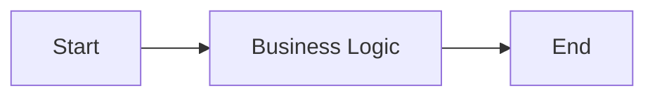

{{projectName}}

# Technical Documentation

**Customer:** {{customerName}}
**Project ID:** {{projectId}}
**Version:** {{version}}
**Author:** {{author}}
**Date:** {{date}}

<!-- pagebreak -->

## Approvals & Knowledge

### Signatures

| Role | Name | Signature | Date |
|---|---|---|---|
| Developer |  |  |  |
| System Analyst |  |  |  |
| Cell Lead SA |  |  |  |
| Cell Lead Dev |  |  |  |

<!-- pagebreak -->

## Introduction

### Purpose

<!-- Agent: describe the purpose of this document and the system it specifies -->

### Background

<!-- Agent: summarize the business context and the problem this system solves -->

### Objectives

<!-- Agent: list the main objectives the system must achieve -->

### References

| Document | Link |
|---|---|
| Business Requirement Document (BRD) | [BRD](input/fsd/BRD.md) |
| Functional Design (FD) | [FD](input/fsd/FD.md) |
| Technical Requirement | [Technical Requirement](input/fsd/TechnicalRequirement.md) |
| ERD | [MASTER_ERD.md](MASTER_ERD.md) |

### Version History

| Version | Date | Author | Description of Changes |
|---|---|---|---|
| {{version}} | {{date}} | {{author}} | Initial document |

## Project Scope

### In Scope

<!-- Agent: derived from the FD — what the system WILL cover -->

### Out of Scope

<!-- Agent: derived from the FD — what the system will NOT cover -->

## Effort Estimation

| Module | Story Points | Estimated Effort (person-days) | Notes |
|---|---|---|---|
|  |  |  |  |

<!-- pagebreak -->

## System Overview

<!-- Agent: replace this placeholder with a Mermaid business-logic flowchart of the system -->



<!-- pagebreak -->

## Requirement Detail

<!-- Agent: breakdown SETIAP Functional Design (FD) secara terpisah — JANGAN menggabungkan beberapa FD menjadi satu. Kelompokkan FD per module dengan heading bernomor (`### 1. <Module>`), lalu untuk setiap FD ulangi struktur di bawah: FE spec → BE spec → satu sub-bagian per endpoint (`##### METHOD /path`) dengan tabel 2 kolom (Field | Value). Kolom 1 = fields, kolom 2 = values. JANGAN pakai tabel lebar 8 kolom. -->

### 1. <Nama Module>

#### FD001 — <Nama Fitur>

* **Front End Specification**

<!-- Agent: screens, komponen, alur UI, dan API yang dikonsumsi -->

* **Back End specification**

##### POST /<endpoint>

| **Field** | **Value** |
| --- | --- |
| Type | REST API |
| Status | NEW |
| Description |  |
| Endpoint | /<endpoint> |
| Method | POST |
| Request |  |
| Response |  |
| Table Related |  |

<!-- Agent: tambahkan baris opsional di tabel sesuai kebutuhan — Note, Validation, Logic, Mapping. Untuk non-endpoint (mis. scheduler/cron) gunakan Type yang sesuai, contoh: "Cron Job (S1)". -->

### 2. <Nama Module>

#### FD002 — <Nama Fitur>

* **Front End Specification**

<!-- Agent: screens, komponen, alur UI, dan API yang dikonsumsi -->

* **Back End specification**

##### PUT /<endpoint>

| **Field** | **Value** |
| --- | --- |
| Type | REST API |
| Status | NEW |
| Description |  |
| Endpoint | /<endpoint> |
| Method | PUT |
| Request |  |
| Response |  |
| Table Related |  |

### 3. <Nama Module>

<!-- Agent: lanjutkan sampai semua module & FD tercakup. -->

#### FD003 — <Nama Fitur>

* **Front End Specification**

* **Back End specification**

##### GET /<endpoint>

| **Field** | **Value** |
| --- | --- |
| Type | REST API |
| Status | NEW |
| Description |  |
| Endpoint | /<endpoint> |
| Method | GET |
| Request |  |
| Response |  |
| Table Related |  |

<!-- pagebreak -->

## Lampiran ERD

<!-- Agent: replace this placeholder with a Mermaid ER diagram of all tables and relationships -->

```mermaid
erDiagram
  ENTITY_1 {
    id PK
  }
```

## Data Specification

| Table | Column | Data Type | Constraint | Description |
|---|---|---|---|---|
|  |  |  |  |  |
